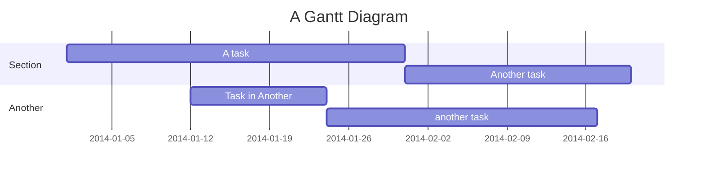

# 前言❗
Mermaid是一个非常实用的渲染器，可以以简单的语法生成流程图、甘特图、思维导图等多种类型的图片。Docsify官方推荐通过引入cdn托管的js和css文件，经过简单配置使docsify文档支持Mermaid。
但我在按此流程完成时出现了问题。代码如下：
``` html
<!--必须在initialize操作前引入-->
<link rel="stylesheet" href="//cdn.jsdelivr.net/npm/mermaid/dist/mermaid.min.css">
<script src="//cdn.jsdelivr.net/npm/mermaid/dist/mermaid.min.js"></script>

var num = 0;
mermaid.initialize({ startOnLoad: false });

window.$docsify = {
  markdown: {
    renderer: {
      code: function (code, lang) {
        if (lang === "mermaid") {
          return '<div class="mermaid">' + mermaid.render("mermaid-svg-" + num++, code) + "</div>";
        }
        return this.origin.code.apply(this, arguments);
      },
    },
  },
};
```
Mermaid渲染结果无法正常显示，而是返回`[object Promise]`。
查询官方github仓库的issue等之后，在Stackoverflow的[这个回答](https://stackoverflow.com/questions/76530311/mermaid-in-docsify-return-object-promise)下找到了原因。

# 原因
> Since the Mermaid version 10, the render function now returns a Promise, not a plain value, and thus you have "[Object Promise]" in the resulting html instead of a diagram.

从 Mermaid 10 版本开始，`mermaid.render` 方法返回一个 Promise 而不是直接返回渲染后的 SVG 字符串。这意味着你需要处理这个 Promise，并在它完成时更新 DOM。如果你直接将 mermaid.render 的返回值插入到 HTML 中，那么你会看到 `[object Promise]`，因为这是 JavaScript 在尝试字符串化一个 Promise 对象时的结果。

为了正确处理这种情况，需要使用 .then() 或 async/await 来等待 Promise 完成，并在完成后更新 DOM 。该方法实现起来已经较为复杂了。

# 解决
[这个回答](https://stackoverflow.com/questions/76530311/mermaid-in-docsify-return-object-promise)用更简单的方式解决了该问题，将此代码块加入`index.html`中`body`块的末尾。使用`mermaid-docsify`这个新插件实现渲染。
```html
<script type="module">
    import mermaid from "https://cdn.jsdelivr.net/npm/mermaid@10/dist/mermaid.esm.min.mjs";
    mermaid.initialize({ startOnLoad: true });
    window.mermaid = mermaid;
  </script>
  <script src="//unpkg.com/docsify-mermaid@2.0.1/dist/docsify-mermaid.js"></script>
```

# 效果

    ```mermaid
    gantt
        title A Gantt Diagram
        dateFormat YYYY-MM-DD
        section Section
            A task          :a1, 2014-01-01, 30d
            Another task    :after a1, 20d
        section Another
            Task in Another :2014-01-12, 12d
            another task    :24d
    ```

