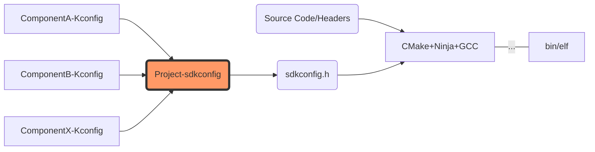
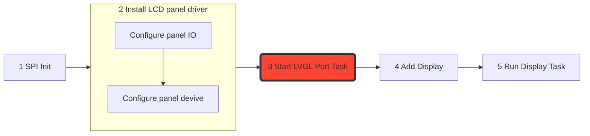

# 第三篇：ST7789LCD-LVGL移植与应用

## 概述
任何电子产品都离不开交互。LCD能够提供图形化界面以便交互，因此，引入LCD和图形库是很有必要的。手上有ST7789和HX8369两类LCD屏幕。基于ESP32的处理能力，还是采用像素量较小的ST7789LCD屏幕用来显示较好。

## 学习目标
回答以下几个问题：
- ESP-IDF的组件与外部组件如何管理？有什么注意事项？外部组件怎样参与构建与编译？
- ESP-IDF如何引入LVGL？LVGL如何控制屏幕显示？
- LVGL需要多大的内存来运行？ESP32能否提供足够的内存空间？当内存不足时会出现什么现象？
- ST7789LCD产生显示不全、图像偏移、颜色失真等问题，可能的原因和解决办法？应当如何调试LCD屏幕？

#### ESP-IDF的组件管理与构建编译过程

需要注意的是，ESP-IDF官方文档“不建议自行修改`managed_components`中的内容”，也就是说，应当将其完全交由组件管理器(ESP Component Registry)来管理。

ESP-IDF组件包含`Kconfig`文件，该文件定义了可以修改的配置项。

ESP-IDF采用`idf_component.yml`文件声明组件依赖关系，这与ROS中的`package.xml`类似。当组件被组件管理器安装后，组件配置`Kconfig`被添加到`menuconfig`中，因此可以在全局的`menuconfig`下配置。用户在`menuconfig`中做出的选择会保存到项目根目录下的`sdkconfig`文件中。这个文件包含了所有配置项的当前设置，格式为`Kconfig`格式的键值对。

构建开始时，ESP-IDF构建系统会读取`sdkconfig`文件，并将其中的配置项转换为适合C/C++编译器使用的预处理器宏定义。这通常通过一个名为`sdkconfig.h`的头文件完成，该文件自动生成并在编译过程中包含。

在代码中，可以使用预处理器宏或函数来访问这些配置项。例如，对于布尔配置项，可以直接使用宏检查其状态；对于数值配置项，可以使用`CONFIG_`前缀加上配置项名称来获取值。

`ESP-IDF`使用`CMake`作为构建系统。运行编译任务时，`CMake`会根据项目的`CMakeLists.txt`文件和`sdkconfig.h`中的配置项生成适当的`Makefile`或`Ninja`构建文件。然后，构建工具（如`GNU Make`或`Ninja`）会编译源代码，链接库文件，并最终生成固件二进制文件。

对于ESP-IDF内置组件，如ST7789驱动程序等，并不需要在`CMakeLists.txt`中声明包含路径，而是可以直接调用，ESP-IDF会自动包含这些文件参与编译。



#### 合理地引入LVGL控制LCD显示

合理，意味着采用官方推荐的规范，把文件放在合适的地方，使用推荐的程序接口编写代码。

LVGL是一个第三方的组件，因此应该在组件管理器`ESP Component Registry`中下载和使用。需要的是LVGL的源组件和接口组件。官方提供的ESP32的LVGL例程为`i2c_oled`，屏幕是由SSD1306驱动的OLED。理论上说，ST7789LCD屏幕作为组件也应置于组件管理器中，但是，ESP-IDF已将其置于内置组件库中，可直接调用。

在组件管理器`Install`:
- lvgl/lvgl: ^9.2.2
- espressif/esp_lvgl_port: ^2.4.3

要注意：不同版本的lvgl的API有所不同，应按照对应版本修改。

当`Install`完成后，可以在文件目录的`managed_components`下看到两个组件的文件夹。此时，每个组件的配置信息已经自动添加到ESP-IDF的`menuconfig`之中。ESP32需要配置好接口才能正常使用LVGL。

下面显示了ESP32启动LVGL显示图像的流程：

1. SPI Init
   - 配置好基本的SPI通信功能，由于ST7789为ESP-IDF内置组件，因此其初始化可通过调用API完成，参见第2步
2. Install LCD panel driver
   - 配置panel IO，使LVGL可以管理LCD的选通(CS)与复位(RST)，涉及`esp_lcd_panel_io_spi_config_t`配置结构体与`esp_lcd_new_panel_io_spi`函数
   - 配置panel devive,实例化一个LCD屏幕，涉及`esp_lcd_panel_dev_config_t`配置结构体与`esp_lcd_new_panel_st7789`函数
3. ⚠️**Start LVGL Port Task**
     - 配置并启动LVGL任务。ESP32在lvgl port组件中定义了`lvgl_port_task`，该任务的配置信息是使用`ESP_LVGL_PORT_INIT_CONFIG()`宏定义的，并作为句柄传输给`lvgl_port_init`执行初始化任务。
     - `lvgl_port_task`任务**非常重要**，因为它调用`lv_timer_handler()`函数（对应用户API被封装为`lv_task_handler()`）执行LVGL的动画刷新、事件处理等各种功能，其任务周期即LVGL显示的刷新周期。因此**不需要自定义刷新任务**。在`lvgl_port_task`任务配置时应填写合适的刷新周期，过短则硬件处理能力有限无法达成，过长则影响GUI显示流畅性。
     - `lvgl_port_init`的顺序必须按此顺序，即在LCD驱动初始化完毕后，再启动LVGL任务。
4. Add Display
   - 添加屏幕，定义屏幕属性，使LVGL可以通过SPI接口发送命令，分配显示缓存
   - 涉及`lvgl_port_display_cfg_t`配置结构体与`lvgl_port_add_disp`函数
5. Display
   - 运行自定义显示任务
   - 显示函数应置于`lvgl_port_lock`和`lvgl_port_unlock`之间，即lvgl互斥锁保护段内

下面是本例代码（略去SPI初始化，与官方例程相同；此部分为运行代码，文中其余部分代码均作为调试用）：

``` c
//...
#include "esp_lcd_io_spi.h"
#include "esp_lcd_panel_st7789.h"
#include "esp_lcd_panel_vendor.h"
#include "esp_log.h"
#include "esp_lvgl_port.h"
#include "hal/spi_types.h"
#include "lvgl.h"
#include "misc/lv_color.h"
//...

#define PIN_NUM_MISO 25
#define PIN_NUM_MOSI 23
#define PIN_NUM_CLK 19
#define PIN_NUM_CS 22

#define PIN_NUM_DC 21
#define PIN_NUM_RST 18
#define PIN_NUM_BCKL 5

#define LCD_BK_LIGHT_ON_LEVEL 1
#define DISP_WIDTH 240  // 240
#define DISP_HEIGHT 280 // Test:300
#define X_OFFSET 0
#define Y_OFFSET 20

void display_test_image(lv_disp_t *disp) {
  const char *TAG = "Task";
  ESP_LOGI(TAG, "LVGL task running");
  // 创建一个全屏的颜色填充 (例如蓝色背景)
  lv_obj_t *background = lv_obj_create(lv_disp_get_scr_act(disp));
  lv_obj_set_size(background, lv_disp_get_hor_res(NULL),
                  lv_disp_get_ver_res(NULL));
  lv_obj_set_style_bg_color(background, lv_color_make(0, 0, 255), LV_PART_MAIN);
  lv_obj_align(background, LV_ALIGN_CENTER, 0, 0);

  // 绘制一个渐变矩形
  lv_obj_t *gradient_box = lv_obj_create(background);
  lv_obj_set_size(gradient_box, 200, 100);
  lv_obj_align(gradient_box, LV_ALIGN_CENTER, 0, 0);
  static lv_style_t style_grad;
  lv_style_init(&style_grad);
  lv_style_set_bg_opa(&style_grad, LV_OPA_COVER);
  lv_style_set_bg_grad_color(&style_grad, lv_color_make(255, 0, 0)); // 红色
  lv_style_set_bg_color(&style_grad, lv_color_make(0, 255, 0));      // 绿色
  lv_style_set_bg_grad_dir(&style_grad, LV_GRAD_DIR_VER); // 垂直渐变
  lv_obj_add_style(gradient_box, &style_grad, LV_STATE_DEFAULT);

  // 添加一些文本
  lv_obj_t *label = lv_label_create(lv_disp_get_scr_act(disp));
  lv_label_set_text(label, "Test Image");
  lv_obj_align(label, LV_ALIGN_BOTTOM_MID, 0, -20);
}

void create_loading_animation(lv_disp_t *disp) {
  // 创建一个 spinner 控件作为加载指示器
  lv_obj_t *spinner = lv_spinner_create(lv_disp_get_scr_act(disp));
  lv_obj_set_size(spinner, 50, 50);             // 设置 spinner 的大小
  lv_obj_align(spinner, LV_ALIGN_CENTER, 0, 0); // 将 spinner 居中对齐
}

// 1. SPI Init
static void st7789_spi_init(void) {
  esp_err_t ret;
  spi_device_handle_t spi;
  spi_bus_config_t buscfg = {.miso_io_num = PIN_NUM_MISO,
                             .mosi_io_num = PIN_NUM_MOSI,
                             .sclk_io_num = PIN_NUM_CLK,
                             .quadwp_io_num = -1,
                             .quadhd_io_num = -1,
                             .max_transfer_sz = PARALLEL_LINES * 320 * 2 + 8};
  spi_device_interface_config_t devcfg = {
#ifdef CONFIG_LCD_OVERCLOCK
      .clock_speed_hz = 26 * 1000 * 1000, // Clock out at 26 MHz
#else
      .clock_speed_hz = 10 * 1000 * 1000, // Clock out at 10 MHz
#endif
      .mode = 0,                  // SPI mode 0
      .spics_io_num = PIN_NUM_CS, // CS pin
      .queue_size = 7, // We want to be able to queue 7 transactions at a time
      .pre_cb = lcd_spi_pre_transfer_callback, // Specify pre-transfer callback
                                               // to handle D/C line
  };
  // Initialize the SPI bus
  ret = spi_bus_initialize(LCD_HOST, &buscfg, SPI_DMA_CH_AUTO);
  ESP_ERROR_CHECK(ret);
  // Attach the LCD to the SPI bus
  ret = spi_bus_add_device(LCD_HOST, &devcfg, &spi);
  ESP_ERROR_CHECK(ret);
}

static lv_disp_t *lvgl_config_init(void) {
  lv_disp_t *disp_handle = NULL;
  // 2. Install LCD panel driver
  // 2.1 Configure panel IO
  ESP_LOGI(TAG, "Install ST7789 panel driver");
  ESP_LOGI(TAG, "Configuring ST7789 Panel IO");
  esp_lcd_spi_bus_handle_t spi_bus = LCD_HOST;
  esp_lcd_panel_io_spi_config_t io_config = {.cs_gpio_num = PIN_NUM_CS,
                                             .dc_gpio_num = PIN_NUM_DC,
                                             .pclk_hz = 10 * 1000 * 1000,
                                             .spi_mode = 0,
                                             .trans_queue_depth = 10,
                                             .lcd_cmd_bits = 8,
                                             .lcd_param_bits = 8};

  esp_lcd_panel_io_handle_t io_handle = NULL;
  ESP_LOGI(TAG, "Configuring ST7789 Panel");
  ESP_ERROR_CHECK(esp_lcd_new_panel_io_spi(spi_bus, &io_config, &io_handle));
  // 2.2 Configure panel devive
  esp_lcd_panel_handle_t lcd_panel_handle = NULL;
  esp_lcd_panel_st7789_config_t st7789_config = {.width = DISP_WIDTH,
                                                 .height = DISP_HEIGHT};
  esp_lcd_panel_dev_config_t panel_config = {.bits_per_pixel = 16,
                                             .reset_gpio_num = PIN_NUM_RST,
                                             .vendor_config = &st7789_config};
  esp_lcd_new_panel_st7789(io_handle, &panel_config, &lcd_panel_handle);

  ESP_ERROR_CHECK(esp_lcd_panel_reset(lcd_panel_handle));
  ESP_ERROR_CHECK(esp_lcd_panel_init(lcd_panel_handle));
  ESP_ERROR_CHECK(esp_lcd_panel_set_gap(lcd_panel_handle, X_OFFSET, Y_OFFSET)); // Set Offset
  ESP_ERROR_CHECK(esp_lcd_panel_invert_color(lcd_panel_handle, true));
  ESP_ERROR_CHECK(esp_lcd_panel_disp_on_off(lcd_panel_handle, true));
  // check_heap_memory();
  // 3. Start LVGL Port Task
  const lvgl_port_cfg_t lvgl_cfg = ESP_LVGL_PORT_INIT_CONFIG();
  ESP_ERROR_CHECK(lvgl_port_init(&lvgl_cfg));
  // 4. Add Display
  ESP_LOGI(TAG, "Initialize LVGL");
  const lvgl_port_display_cfg_t disp_cfg = {
      .io_handle = io_handle,
      .panel_handle = lcd_panel_handle,
      .buffer_size = DISP_WIDTH * DISP_HEIGHT / 2,
      .double_buffer = false,
      .hres = DISP_WIDTH,
      .vres = DISP_HEIGHT,
      .monochrome = false,
      .color_format = LV_COLOR_FORMAT_RGB565,
      .rotation =
          {
              .swap_xy = false,
              .mirror_x = false,
              .mirror_y = false,
          },
      .flags = {
          .buff_dma = true,
          .swap_bytes = true, // swap color bytes!
      }};
  ESP_LOGI(TAG, "Deinitialized num of disp_handle: %x",
           (uintptr_t)(disp_handle));
  disp_handle = lvgl_port_add_disp(&disp_cfg);
  ESP_LOGI(TAG, "SizeOf lv_color_t: %d", (int)sizeof(lv_color_t));
  ESP_LOGI(TAG, "Initialized num of disp_handle: %x", (uintptr_t)(disp_handle));
  return disp_handle;
}

void app_main(void) {
  // 1. SPI Init
  st7789_spi_init();
  // 2~4. Install LCD panel driver & Add Display
  const lv_disp_t *disp = lvgl_config_init();
  // Check if display is initialized, if so, disp pointer is not NULL
  ESP_LOGI(TAG, "Is num of disp_handle: %x", (uintptr_t)(disp));
  // lv_disp_set_rotation(disp, LV_DISPLAY_ROTATION_270); //If necessary
  ESP_LOGI(TAG, "Display LVGL Test Image");
  // check_heap_memory();
  if (lvgl_port_lock(0)) {
    display_test_image(disp);
    create_loading_animation(disp);
    lvgl_port_unlock();
  }
}
```
##### 最终显示效果

可见边框、排列、颜色均正确，动画可正常加载（实测）：


#### ESP32的内存与LVGL的显存

##### 内存与显存分配
ESP32的内存段分配（可参考[ELF结构详解](https://www.cnblogs.com/QiQi-Robotics/p/15573352.html)）可以参看编译输出的内存使用摘要(Memory Type Usage Summary)。

| Memory Type/Section | Used [bytes] | Used [%] | Remain [bytes] | Total [bytes] |
|---------------------|--------------|----------|----------------|---------------|
| **Flash Code**          |      317,770 |    9.51% |        3,024,534 |       3,342,304 |
|    .text            |      317,770 |    9.51% |                - |               - |
| **DRAM**                |      172,844 |   95.63% |             7,892 |         180,736 |
|    .bss             |      162,592 |   89.96% |                - |               - |
|    .data            |       10,252 |    5.67% |                - |               - |
|**Flash Data**          |       73,420 |    1.75% |        4,120,852 |       4,194,272 |
|    .rodata          |       73,164 |    1.74% |                - |               - |
|    .appdesc         |           256 |    0.01% |                - |               - |
| **IRAM**                |       61,463 |   46.89% |           69,609 |         131,072 |
|    .text            |       60,435 |   46.11% |                - |               - |
|    .vectors         |        1,027 |    0.78% |                - |               - |
| **RTC SLOW**            |           24 |    0.29% |           8,168 |           8,192 |
|    .rtc_slow_reserved|           24 |    0.29% |                - |               - |

由于显示数据置于缓存，采用一次性DMA发送，能提高效率，因此使用LVGL必须为其分配显存。但是，在ESP32这类资源有限的嵌入式设备中，分配多少显存才能兼顾性能与资源？

首先，LVGL采用`heap_caps_malloc`函数分配内存，当然，具体的内存分配函数也是可以通过`menuconfig`修改的。这个函数在调用`lvgl_port_add_disp`函数时被调用，`lvgl_port_add_disp`会分配`显存像素数量*sizeof(lv_color_t)`字节的空间。`heap_caps_malloc`函数从堆内存中分配内存。堆内存主要占用ESP32的DRAM的空间。DRAM 在 ESP32 中指的是内部 SRAM 中用于数据存储的部分。IRAM 是内部 SRAM 中用于存放代码的部分，DRAM 和 IRAM 实际物理存储介质均为 ESP32 Internal RAM，即内部 SRAM。具体描述参阅[esp32_reference_mannual.pdf](https://www.espressif.com/sites/default/files/documentation/esp32_technical_reference_manual_cn.pdf)。

然后，计算一下300*240像素的LCD需要的显存大小。如果按显存缓存一整个屏幕的像素信息来计算，颜色模式采用RGB565，每个像素需要3个字节(实测)来储存像素信息。那么总共需要缓存字节数为
$$300\times240\times3=216000\quad bytes$$

显然，该缓存大小已经超出了DRAM所有字节数180,736bytes。

当内存不足，无法分配内存时，ESP32将发生内存分配错误，此错误会使内存分配的任务进入死循环，令空闲任务(IDLE Task)无法获得CPU时间，导致喂狗失败，触发看门狗重启ESP32系统。看门狗的喂狗时间间隔可以在`menuconfig`中配置，本例中时间为5s。

内存不足，要么开源，要么节流。开源的方法之一就是使用外部PSRAM，这是直接增加内存的最快方法，需要在`menuconfig`中勾选`Support for external, SPI-Connected RAM`选项。由于使用的ESP32没有外部PRAM，因此此法不可用。因此这里采用节流的方法，也就是减少申请的字节数。如果字节数过低，则会导致刷新一帧时，需要多次搬运数据和传输，会增大传输开销。因此，申请一个较合适的较大值更合理，这里申请缓存的字节数为

$$300\times240\times3\div2=108000\quad bytes$$

如此设置，则全屏幕刷新一次调用两次DMA传输即可完成，每次缓存数据准备时间相同。DMA传输不占用CPU时间，因此能提高效率。另外还要**注意**，该缓存字节数不应超过SPI初始化时定义的`.max_transfer_sz`，ESP32 SPI不会尝试一次性传输超过此数量的数据。

如何监测运行时的内存数据？ESP-IDF提供了一系列用于监测内存数据的函数，由此可自定义内存监测函数：

``` c
void check_heap_memory(void) {
  const char *TAG = "MEMORY";
  // 打印总的可用堆内存
  ESP_LOGI(TAG, "Free heap size: %d bytes", (int)esp_get_free_heap_size());
  // 打印自启动以来最小的空闲堆内存
  ESP_LOGI(TAG, "Minimum free heap size since boot: %d bytes",
           (int)esp_get_minimum_free_heap_size());
  // 打印 DRAM 区域的详细信息
  ESP_LOGI(TAG, "DRAM heap info:");
  heap_caps_print_heap_info(MALLOC_CAP_8BIT);
  // 打印 IRAM 区域的详细信息
  ESP_LOGI(TAG, "IRAM heap info:");
  heap_caps_print_heap_info(MALLOC_CAP_IRAM_8BIT);
}
```
应用：
``` c
//...
  check_heap_memory();
  /* Add LCD screen */
  ESP_LOGI(TAG, "Initialize LVGL");
  const lvgl_port_display_cfg_t disp_cfg = {
      .io_handle = io_handle,
      .panel_handle = lcd_panel_handle,
      .buffer_size = DISP_WIDTH * DISP_HEIGHT / 2,
      .double_buffer = false,
      .hres = DISP_HEIGHT,
      .vres = DISP_WIDTH,
      .monochrome = false,
      .color_format = LV_COLOR_FORMAT_RGB565,
      .rotation =
          {
              .swap_xy = false,
              .mirror_x = false,
              .mirror_y = false,
          },
      .flags = {
          .buff_dma = true,
          .swap_bytes = true, // swap color bytes!
      }};
  disp_handle = lvgl_port_add_disp(&disp_cfg);

  lv_disp_set_rotation(disp_handle, 2);

  ESP_LOGI(TAG, "Display LVGL Test Image");
  check_heap_memory();
  ESP_LOGI("LVGL", "SizeOf lv_color_t: %d", (int)sizeof(lv_color_t));
  // Start lvgl task
  if (lvgl_port_lock(0)) {
    display_test_image(disp_handle);
    lvgl_port_unlock();
  }
//...
```
用该函数监测结果如下，此时屏幕像素数为301*240：
``` 
I (972) MEMORY: Free heap size: 131336 bytes
I (972) MEMORY: Minimum free heap size since boot: 131336 bytes
I (972) MEMORY: DRAM heap info:
...略...
I (1042) LCD: Initialize LVGL
I (1052) LCD: Display LVGL Test Image
I (1052) MEMORY: Free heap size: 22556 bytes
I (1152) MEMORY: Minimum free heap size since boot: 22556 bytes
I (1152) MEMORY: DRAM heap info:
...略...
I (1212) MEMORY: IRAM heap info:
Heap summary for capabilities 0x00002000:
  Totals:
    free 0 allocated 0 min_free 0 largest_free_block 0
I (1222) LVGL: SizeOf lv_color_t: 3
I (1232) Task: LVGL task running
I (1232) main_task: Returned from app_main()
```
可用堆内存减少了

$$131336 - 22556 = 108780\quad bytes$$

这个数字约等于申请的显存大小。

#### LCD屏幕的调试

ST7789为采用4线SPI通讯的LCD驱动芯片。
调试LCD的核心方法：
1. 正确初始化
   - 正确接线
   - 选择正确的通信模式和时钟频率
2. 绘制一个像素
   - 先不用考虑LVGL，在基础的硬件抽象层，编写一个绘制一个像素的函数，为调试做准备。
3. 绘制定位矩形
    - 定位矩形是在任一位置绘制长宽可变的矩形
    - 之所以绘制普通矩形而非正方形，是为了简单地测试出屏幕方向
    - 找到ST7789内存行列与实际像素宽高的对应关系

下面对遇到的问题逐个解决：

**未添加LVGL组件的调试**
- 显示不全问题


按照LCD模块上的标注，定义屏幕宽高为 `240*280`。但在此尺寸下，无论是否加载LVGL，都会出现显示不全的现象。一开始，认为是像素偏移，也就是厂家因装配等因素选择了特定显示区域，其内存映射地址不是从(0,0)开始的。ST7789的实际可控像素大于 `240*280`，因此有些内存地址确实可能无效。ST7789的命令中可以指定发送像素数据至ST7789内存的起始位置与终止位置，因此可以调整其偏移量(offset)。

如果确实是像素偏移，那么每次传输数据都需要使偏移量参与计算。但无论如何调整偏移量，都无法正确归位。也就是无法正确将像素数据写入指定位置。于是猜测，屏幕像素的宽高定义可能相反，导致部分像素无效。对换宽高的数值，显示结果如下:


可见终止像素超过边界，覆盖了起始的像素，但从此现象难以判断具体问题。在存在LVGL的情况下调试，由于参数经过多重定义，调试十分困难。因此应该先在无LVGL时先调好这个问题。以下是基于自定义的ST7789驱动的绘制函数。后续实际使用时，采用的则是官方的`esp_lcd_panel_st7789`组件。

``` c
static void lcd_draw_one_pixel(spi_device_handle_t spi, uint16_t x, uint16_t y,
                           uint16_t color) {
  esp_err_t ret;
  spi_transaction_t trans[6];

  // Column Address Set
  memset(&trans[0], 0, sizeof(spi_transaction_t));
  trans[0].length = 8;
  trans[0].tx_data[0] = 0x2A;
  trans[0].flags = SPI_TRANS_USE_TXDATA;
  trans[0].user = (void *)0;

  memset(&trans[1], 0, sizeof(spi_transaction_t));
  trans[1].length = 8 * 4;
  trans[1].tx_data[0] = x >> 8;
  trans[1].tx_data[1] = x & 0xff;
  trans[1].tx_data[2] = x >> 8;
  trans[1].tx_data[3] = x & 0xff;
  trans[1].flags = SPI_TRANS_USE_TXDATA;
  trans[1].user = (void *)1;

  // Row Address Set
  memset(&trans[2], 0, sizeof(spi_transaction_t));
  trans[2].length = 8;
  trans[2].tx_data[0] = 0x2B;
  trans[2].flags = SPI_TRANS_USE_TXDATA;
  trans[2].user = (void *)0;

  memset(&trans[3], 0, sizeof(spi_transaction_t));
  trans[3].length = 8 * 4;
  trans[3].tx_data[0] = y >> 8;
  trans[3].tx_data[1] = y & 0xff;
  trans[3].tx_data[2] = y >> 8;
  trans[3].tx_data[3] = y & 0xff;
  trans[3].flags = SPI_TRANS_USE_TXDATA;
  trans[3].user = (void *)1;

  // Memory Write
  memset(&trans[4], 0, sizeof(spi_transaction_t));
  trans[4].length = 8;
  trans[4].tx_data[0] = 0x2C;
  trans[4].flags = SPI_TRANS_USE_TXDATA;
  trans[4].user = (void *)0;

  memset(&trans[5], 0, sizeof(spi_transaction_t));
  trans[5].length = 16;
  trans[5].tx_data[0] = color >> 8;
  trans[5].tx_data[1] = color & 0xff;
  trans[5].flags = SPI_TRANS_USE_TXDATA;
  trans[5].user = (void *)1;

  // Queue all transactions.
  for (int i = 0; i < 6; i++) {
    ret = spi_device_queue_trans(spi, &trans[i], portMAX_DELAY);
    assert(ret == ESP_OK);
  }
```

``` c
static void lcd_draw_rectangle(spi_device_handle_t spi, uint16_t x, uint16_t y,
                               uint16_t width, uint16_t height,
                               uint16_t color) {
  for (int i = 0; i < width; i++) {
    for (int j = 0; j < height; j++) {
      lcd_draw_one_pixel(spi, x + i, y + j, color);
    }
  }
}
```
使用矩形绘制函数`lcd_draw_rectangle`分别绘制两个矩形，一个填充整个屏幕，一个从(0,0)点开始，宽高为`50*100`。即：
``` c
  lcd_draw_rectangle(spi, 0, 0, DISP_WIDTH, DISP_HEIGHT, 0xffff);
  lcd_draw_rectangle(spi, 0, 0, 50, 100, 0x0000);
```
显示结果如下图a：

|(a)280*240|(b)300*240|
|---|---|
|||

由`lcd_draw_rectangle`的实现可见，**ST7789内存地址(0,0)对应左上角像素**，屏幕向右向下为**内存地址递增**方向。屏幕宽度`DISP_WIDTH`应大于屏幕高度`DISP_HEIGHT`。因此实际上，显示不全的问题是**屏幕宽高定义错误**导致的。对换宽高数值，发现仍然有一点显示不全。于是认为标注像素`280*240` 并非实际像素，经过测试，认为实际像素宽高应为 `300*240`，显示结果如上图b。

但是，从此白色矩形本身可以看出，边长比例并非1：2的设定数值，短边短了20个像素，因此推测确实存在像素偏移。所以实际像素应为`280*240`，由于像素偏移，只能采用`300*240`以覆盖LCD显示区域。从后续LVGL显示效果看，在屏幕较长边方向上，居中仍存在偏移。经过查找，发现**官方的`esp_lcd_panel_st7789`组件提供了`esp_lcd_panel_set_gap`函数，用以设置默认像素偏移量**，应在第2步配置Panel device后调用，[此处为显示效果](#最终显示效果)。如果采用第三方的ST7789驱动程序，应该可以设置像素偏移量从而修改屏幕显示区域，即使用`CASET(2Ah)`和`RASET(2Bh)`命令设置传输数据需要送达的ST7789内存区域，此时应能够正常显示。

**添加LVGL组件后的调试**

LVGL初始化设置如下：
``` c
  const lvgl_port_display_cfg_t disp_cfg = {
    .io_handle = io_handle,
    .panel_handle = lcd_panel_handle,
    .buffer_size = DISP_WIDTH * DISP_HEIGHT / 2,
    .double_buffer = false,
    .hres = DISP_HEIGHT,//水平像素，对应高 240
    .vres = DISP_WIDTH,//垂直像素，对应宽 300
    .monochrome = false,
    .color_format = LV_COLOR_FORMAT_RGB565,//颜色模式
    .rotation =
        {
            .swap_xy = false,
            .mirror_x = false,
            .mirror_y = false,
        },
    .flags =
        {
            .buff_dma = true,
            .swap_bytes = true, // swap color bytes!
        }
    };
  disp_handle = lvgl_port_add_disp(&disp_cfg);
```
- 屏幕方向调试
  
   LVGL初始化时需要定义屏幕宽高及方向，如果屏幕宽高错误，会出现显示不全、显示覆盖等问题。能够正常填充屏幕后，利用文字确定合适的旋转方向。
   `lv_disp_set_rotation(disp_handle, 3);`：其中`3` 表示旋转180°。实际上，这个参数应该填写枚举类型值，如`LV_DISPLAY_ROTATION_90`。

   **LVGL的坐标系定义：以左上角为原点(0,0)，向右为x轴正向，向下为y轴正向。**

- 颜色模式
  
   `.color_format = LV_COLOR_FORMAT_RGB565`：ST7789支持的颜色模式有RGB565、RGB666等，这些在数据手册中可以查到，在LCD初始化时已经发送了颜色模式命令，LVGL应该保持与LCD初始化时的一致。

   `.swap_bytes = true`：RGB565模式下每个像素颜色数据为2个字节，如果发现显示颜色与定义不符，应考虑交换发送颜色字节顺序。下图显示交换前后的效果。

|.swap_bytes = false|.swap_bytes = true|
|---|---|
|||

实际上，这个效果仍然不对，因为本例设置的是蓝色背景，中间矩形从绿到红渐变，但是现在整体呈现反色的效果。猜测可能为颜色反转(Color Inversion)设置错误。根据屏幕方向调试的结果看，当设置颜色为0x0000时，呈现白色。这显然不对，因此可以判断该屏幕需要反色才能呈现正常颜色，且在LCD初始化时就应该设置为反色。
在ST7789驱动手册中，反色命令为`21h`，不带参数单独发送。但ST7789作为ESP-IDF内置Component，应使用其提供的API进行初始化设置。查询文档可知，该API为`esp_lcd_panel_invert_color(esp_lcd_panel_handle_t lcd_panel_handle, bool invert_color_data)`，在第2步配置Panel device后调用。效果如下（窗口控件经过调整）：
