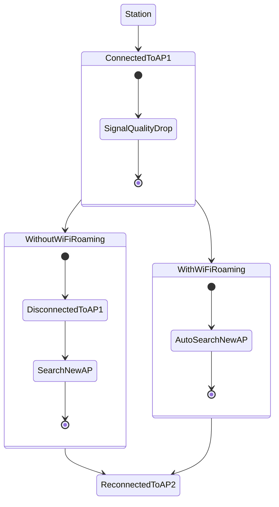
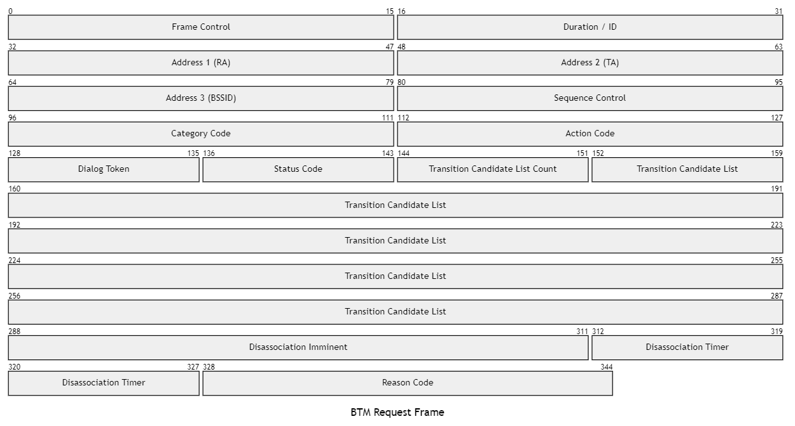
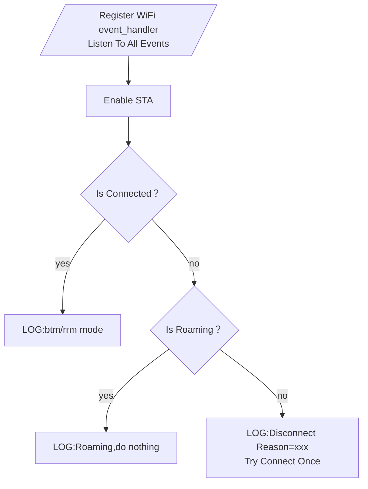

# 第二篇：WiFi漫游(WiFiRoaming)工作原理与例程解读

## roaming_11kvr

> IEEE 802.11k/v/r 标准的 WiFi Roaming

## 学习目标
回答以下几个问题：
- 什么是WiFi roaming？工作过程？有什么作用？
- 什么是BTM？
- 什么是RRM？
- WiFiRoaming时ESP32WiFi工作在什么模式下？
- 本例程中的通信异常处理机制如何实现？

#### WiFi roaming
WiFi roaming是指对于同一个SSID，有多个AP相互覆盖的情况下，当终端设备从一个AP移动至另一个AP覆盖范围时，通过自动选择策略保持切换AP时网络连接可靠性的技术。


WiFi roaming的工作过程主要有以下几步：

扫描：STA会通过主动扫描或被动扫描的方式发现当前所在位置下可用的AP，并测量用于选网判断的网络信息。

主动扫描：STA周期性发送主动扫描帧（Probe request），AP在监听到扫描帧后会进行回复（Probe response），终端收到回复消息后感知AP的存在。
被动扫描：STA通过监听AP周期性发送的 Beacon 帧来感知AP的存在。

#### BTM
BTM(BSS Transmission Management)是实现 WiFi Roaming 的具体机制，由 IEEE 802.11v 定义。

当设定的条件（信号质量低于阈值）被触发时，有两种工作模式，[这里](https://www.cnblogs.com/jw-jackson/articles/18160945)介绍了具体的帧结构：
1. 当前 AP 主动发送 BSS Transition Management Request 帧给 STA。
2. STA 发现更合适的 AP，向当前 AP 发送 BTM query，AP 再发送 BSS Transition Management Request 帧给STA。 

<!-- ```mermaid
---
title: "BTM Request Frame"
---
packet-beta
0-15:"Frame Control"
16-31:"Duration / ID"
32-47:"Address 1 (RA)"
48-63:"Address 2 (TA)"
64-79:"Address 3 (BSSID)"
80-95:"Sequence Control"
96-111:"Category Code"
112-127:"Action Code"
128-135:"Dialog Token"
136-143:"Status Code"
144-151:"Transition Candidate List Count"
152-287:"Transition Candidate List"
288-311:"Disassociation Imminent"
312-327:"Disassociation Timer"
328-344:"Reason Code"
``` -->

注意：上图中 152-287 字段的 Transition Candidate List 是不定长的，这个字段保留了所有候选 AP 的信息。后续字段比特位也随之调整。

[ESP-IDF文档关于无线网络管理](https://docs.espressif.com/projects/esp-idf/zh_CN/latest/esp32/api-guides/wifi.html#id47)有如下描述：
> 无线网络管理让客户端设备能够交换有关网络拓扑结构的信息，包括与射频环境相关的信息。这使每个客户端都能感知网络状况，从而促进无线网络性能的整体改进。这是 802.11v 规范的一部分。它还使客户端能够支持网络辅助漫游。 网络辅助漫游让 WLAN 能够向关联的客户端发送消息，从而使客户端与具有更好链路指标的 AP 关联。这对于促进负载平衡以及引导连接不良的客户端都很有用。
>
>目前 802.11v 的实现支持 BSS 过渡管理帧。

#### RRM
RRM(Radio Resource Management)是一种可升级的射频管理解决方案，通过系统化的实时智能射频管理使无线网络能够快速适应无线环境变化，保持最优的射频资源状态。

RRM包含信道调整与功率调整等多种调整策略，以保障射频无线网络连接的稳定性。

BTM从逻辑上说是RRM的一个部分。

[ESP-IDF文档关于无线资源管理](https://docs.espressif.com/projects/esp-idf/zh_CN/latest/esp32/api-guides/wifi.html#id48)有如下描述：
> 无线电资源测量 (802.11k) 旨在改善网络内流量的分配方式。在无线局域网中，一般情况下，无线设备会连接发射信号最强的接入点 (AP)。根据用户的数量和地理位置，这种分配方式有时会导致某个接入点超负荷而其它接入点利用不足，从而导致整体网络性能下降。在符合 802.11k 规范的网络中，如果信号最强的 AP 已满负荷加载，无线设备则转移到其它未充分利用的 AP。尽管信号可能较弱，但由于更有效地利用了网络资源，总体吞吐量会更大。
>
> 目前 802.11k 的实现支持信标测量报告、链路测量报告和邻居请求。

#### WiFi Roaming 时 ESP32 WiFi 工作在什么模式下
例程中工作在STA模式下。官方文档似乎未给出ESP32的STA/AP混合模式是否支持BTM或RRM机制。限于ESP32的处理能力，一般情况下并不需要如此复杂的网络管理机制，故仅在STA模式下讨论WiFiRoaming的问题。

#### 本例程中的通信异常处理机制如何实现


本例程中的通信异常处理机制主要基于ESP-IDF框架提供的事件处理机制。ESP-IDF是基于FreeRTOS的框架，具有优先级调度功能，但与FreeRTOS的事件机制相比更专注于IoT应用。其通过定义全局事件循环(EventLoop)实现来自硬件和任务(Tasks)的事件处理。

本例程主要应用了WiFi库中预定义的事件类型，通过自定义的事件处理函数(event_handler)实现对连接异常的处理。