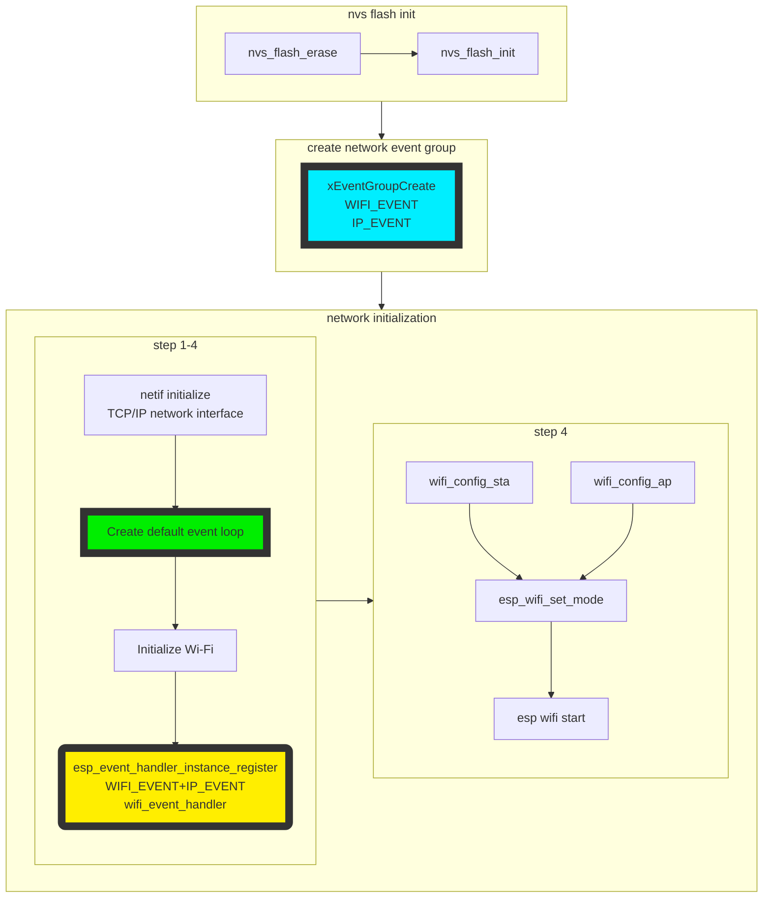
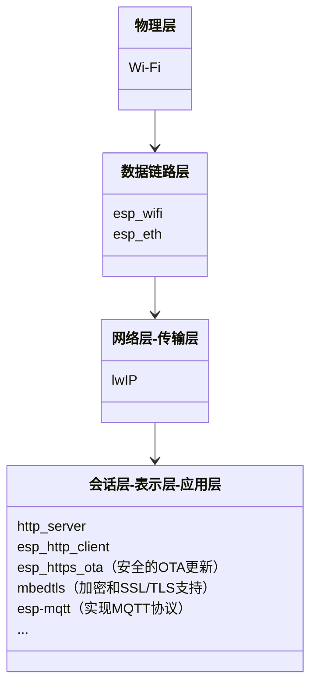

# 第四篇：设置网络时间与天气信息

## 概述
具体的流程应该为，获取网络时间与天气，解析数据，显示数据，当需要修改地区时，可以通过网页端修改，因此需要工作在STA/AP模式下，由于没有其他交互硬件，因此全部通过网页端执行交互。

## 学习目标
回答以下几个问题：
- 如何设置STA/AP模式？需要初始化哪些内容？如何进行事件处理？
- 如何解决WIFI与LVGL共存时内存不足问题？是否存在其他存储问题？
- ESP-IDF的OSI网络层级？如何调用http/https协议请求数据？如何解析返回的数据？
- 如何实现LVGL图片显示、图片编解码？
- 应用层如何设计？数据获取、数据解析、数据显示以及数据修改任务应如何维护数据？每个任务内部逻辑应如何安排才能不互相干扰？这些任务的架构是什么样的？

---
- LVGL文字设置
- 如何设置Wifi自动扫描并连接新AP？
- 如何通过web上传背景图片并通过LVGL展示？
- ESP-IDF应如何正确引入C++？怎样使用C++编写应用层？

## 设置STA/AP模式并处理相应事件

STA与AP共存，既要设置STA，也要设置AP，两者初始化后调用`esp_set_wifi_mode`函数设置为共存模式。**注意：由于WiFi参数需要长期保存，需要放在Flash中，故需先初始化并启用NVS，再配置启用WiFi。**


流程图中有三个彩色框图与事件处理相关。其在流程中的位置均应在事件发生之前。绿色框图创建默认事件循环，处理WiFi事件等系统事件。用户无法使用该循环的句柄。
流程图中蓝色框图创建了FreeRTOS事件标志组用于管理WiFi事件，以便唤起其他基于WiFi的应用程序。因此它的位置应该在WiFi启动之前。
黄色框图注册了与WiFi有关的**事件处理函数**。本例在黄色框图对应的**事件处理函数中设定事件标志位**，自定义RTOS任务等待事件标志组相应比特位，决定是否可以执行。后续随着功能添加，事件也可能增加。这里除了基本连接事件外，还多了一个同步网络时间的功能。在本例中，需要对以下事件进行处理：

1. STA相关事件及处理：
  - WiFi未连接，尝试连接
  - 连接失败，记录错误
  - 连接成功，同步网络时间
2. AP相关事件处理
  - 检测到设备已连接(connected)
  - 检测到设备断开连接(disconnected)

## 存储问题

#### 内存使用与分析
未初始化时：
```
I (612) Before Initialized: DRAM heap info:
Heap summary for capabilities 0x00000004:
  At 0x3ffae6e0 len 6432 free 80 allocated 5820 min_free 80
    largest_free_block 72 alloc_blocks 38 free_blocks 1 total_blocks 39
  At 0x3ffcc568 len 80536 free 68040 allocated 11604 min_free 68040
    largest_free_block 65536 alloc_blocks 5 free_blocks 1 total_blocks 6
  At 0x3ffe0440 len 15072 free 14656 allocated 0 min_free 14656
    largest_free_block 14336 alloc_blocks 0 free_blocks 1 total_blocks 1
  At 0x3ffe4350 len 113840 free 112968 allocated 0 min_free 112968
    largest_free_block 110592 alloc_blocks 0 free_blocks 1 total_blocks 1
  Totals:
    free 195744 allocated 17424 min_free 195744 largest_free_block 110592
```

可用堆内存共有 $195744 Bytes \approx 191KB$

执行LVGL初始化后：
```
I (1022) LVGL Initialized: DRAM heap info:
Heap summary for capabilities 0x00000004:
At 0x3ffae6e0 len 6432 free 4 allocated 5884 min_free 4
    largest_free_block 0 alloc_blocks 41 free_blocks 0 total_blocks 41
At 0x3ffcc568 len 80536 free 60160 allocated 19384 min_free 60160
    largest_free_block 59392 alloc_blocks 30 free_blocks 1 total_blocks 31
At 0x3ffe0440 len 15072 free 14656 allocated 0 min_free 14656
    largest_free_block 14336 alloc_blocks 0 free_blocks 1 total_blocks 1
At 0x3ffe4350 len 113840 free 45764 allocated 67200 min_free 45764
    largest_free_block 45056 alloc_blocks 1 free_blocks 1 total_blocks 2
Totals:
    free 120584 allocated 92468 min_free 120584 largest_free_block 59392
```
可用堆内存共有 $120584 Bytes \approx 117KB$，LVGL使用的堆内存约为
$$191-117 = 74KB$$

这里与前一篇学习记录相比修改了LVGL的显存大小。将`.buffer_size = DISP_WIDTH * DISP_HEIGHT / 2`改为`.buffer_size = DISP_WIDTH * DISP_HEIGHT / 3`。因为要为WiFi功能留出接收、发送缓冲区块。然而仅仅如此还不够，还需要修改默认的WiFi内存分配参数。为了尽量留出堆内存供各种功能使用，需要减少WiFi接收、发送缓冲区块的数量，每个缓存块会占用 $1.6KB$ 内存。其中发送缓冲区块可以改为动态分配形式，这样不会过多占用堆内存。这里暂时只将发送缓冲区块改为动态分配，节省了 $1.6KB\times16=25.6KB$ 的堆内存。如果内存不足，则会导致WiFi初始化失败，触发看门狗重启ESP32。

更改之后，下面是WiFi初始化后内存监测输出：
```
I (1472) WiFi Initialized: DRAM heap info:
Heap summary for capabilities 0x00000004:
  At 0x3ffae6e0 len 6432 free 4 allocated 5884 min_free 4
    largest_free_block 0 alloc_blocks 41 free_blocks 0 total_blocks 41
  At 0x3ffcc568 len 80536 free 9644 allocated 69216 min_free 9468
    largest_free_block 9216 alloc_blocks 201 free_blocks 2 total_blocks 203
  At 0x3ffe0440 len 15072 free 14656 allocated 0 min_free 14656
    largest_free_block 14336 alloc_blocks 0 free_blocks 1 total_blocks 1
  At 0x3ffe4350 len 113840 free 45764 allocated 67200 min_free 45764
    largest_free_block 45056 alloc_blocks 1 free_blocks 1 total_blocks 2
  Totals:
    free 70068 allocated 142300 min_free 69556 largest_free_block 45056
```
剩余可用堆内存为 $69556Bytes \approx 67.9KB$。WiFi使用的堆内存约为
$$ 117-67.9 = 48.1KB$$

剩余内存是**堆栈共用**的，如果太小则程序就无法分配栈空间，故无法正常运行。

#### 进一步折中
若要进一步节省内存，显存仍有进一步释放的空间。在不对显示效果产生重大影响的情况下，可以进一步减小显存缓冲区，但已经及其有限，因为在1/3及1/4缓冲（借用双缓冲概念）时，LCD已经开始周期性地出现LVGL动画闪烁的现象。当然，如果应用不需要特别多动画效果，则可继续作折中平衡。WiFi缓存块也可作一定削减，这将导致吞吐量的降低和可支持的连接数减少。

#### Flash分区

[这个回答](https://blog.csdn.net/qq_44662794/article/details/125248484)提到，ESP32默认分区表设置可用的程序代码存储空间为1M，如果编译产生的bin文件超过1M，则会产生如下类似错误：
```
FAILED: esp-idf/esptool_py/CMakeFiles/app_check_size F:/Temp_Projects/ESP32/TEST/lcd/build/esp-idf/esptool_py/CMakeFiles/app_check_size        
C:\WINDOWS\system32\cmd.exe /C "cd /D F:\Temp_Projects\ESP32\TEST\lcd\build\esp-idf\esptool_py && d:\Software\ESP-IDF\Tools\python_env\idf5.3_py3.11_env\Scripts\python.exe D:/Software/ESP-IDF/v5.3.2/esp-idf/components/partition_table/check_sizes.py --offset 0x8000 partition --type app F:/Temp_Projects/ESP32/TEST/lcd/build/partition_table/partition-table.bin F:/Temp_Projects/ESP32/TEST/lcd/build/spi_master.bin"
Error: app partition is too small for binary spi_master.bin size 0x101770:
```
ESP32 Flash本身全部存储空间一般都在4M及以上，`menuconfig`中定义了这个数值，应按硬件实际情况修改。然后可通过修改分区表的方法来解决以上问题，首先在`menuconfig`中启用自定义分区表，然后创建自定义分区表`partitions.csv`并置于与`main`文件夹同级目录下，将分区表factory程序段空间增加到3M。


`partitions.csv`内容如下：

``` 
# ESP-IDF Partition Table
# Name,   Type, SubType, Offset,  Size, Flags
nvs,      data, nvs,     0x9000,  0x4000,
otadata,  data, ota,     0xd000,  0x2000,
phy_init, data, phy,     0xf000,  0x1000,
factory,  app,  factory, 0x10000,  3M,
```

## 网络架构

#### ESP-IDF框架的OSI网络层级及相应实现组件



#### 发起http/https请求

## LVGL图片显示

在硬件上，由于没有SD卡和PSRAM，为了节省存储空间，同时达到较丰富的展示效果，先后计划并尝试通过以下途径实现图片显示：
1. 以二进制文件形式将jpg,png格式图片嵌入到bin文件中，通过解码器解码为lvgl支持的图片格式进行显示，这样做能节省空间，且可拓展性强，未来可获取网络图片并显示。经测试，tjpgd解码输出格式与lvgl所需格式不符；出于主线任务完成度考虑，暂时放弃进一步魔改解码器👿。
2. 以二进制文件形式将符合lvgl图片格式的图片打包嵌入到bin文件中，优点是可批量操作，步骤较为简易；缺点是不改变图片大小，且LVGL官方暂未提供对lvgl_v9图片文件打包为bin的在线脚本。
3. 使用lvgl转换器将图片转换为c数组文件，与源码共同参与编译，可直接通过lvgl显示，占用空间较大，测试样例为96px*96px时占用约2KB空间，但不需要解码，速度快。RO段保守可存储50张2KB图片，缺点是需要逐个转换并参与编译。
4. 对于icon型文件，转换为字库类型，之后使用lvgl字库在线转换，转换为lvgl符号型图片（实际为特殊字库）后作为源码参与编译。优点是节省空间，调用方便，批量操作脚本编写较容易；缺点是难以修改图片大小，且只有灰度颜色或二值颜色。

经过测试比较，选择3和4相互辅助，作为LVGL图片显示的方法。

另外LVGL内部提供了约20个符号，其中包括WiFi符号等，十分符合应用场景。

## 应用架构

HMI任务、网络时间同步与显示任务、天气数据获取与显示任务

#### 网络时间同步与显示任务
目前，网络时间采用sntp直接同步，没有采用官方推荐的`esp_netif component`。网络时间同步采用事件处理机制，当检测到ESP32成功连接到WiFi并获取IP地址后，初始化SNTP服务并执行一次网络时间同步，同步步骤如下：

``` c
void sntp_initialize(void) {
  ESP_LOGI(TAG, "Initializing SNTP...");
  esp_sntp_stop();

  // Set timezone to China Standard Time
  setenv("TZ", "CST-8", 1);
  tzset();

  // Initialize SNTP
  esp_sntp_setoperatingmode(SNTP_OPMODE_POLL);
  esp_sntp_setservername(0, "pool.ntp.org"); // More time servers can be added
  sntp_set_time_sync_notification_cb(time_sync_notification_cb);  // Set callback to get time

  // Start SNTP
  esp_sntp_init();
}
```

🤔未来考虑使用官方推荐的组件及API如下，因为可以通过此种方式设置**等待动画**，另外可加强线程安全：

``` c
esp_sntp_config_t config = ESP_NETIF_SNTP_DEFAULT_CONFIG("pool.ntp.org");
esp_netif_sntp_init(&config);

if (esp_netif_sntp_sync_wait(pdMS_TO_TICKS(10000)) != ESP_OK) {
    printf("Failed to update system time within 10s timeout");
}
```

网络时间的显示应用了lvgl定时器，在lvgl定时器内以1s周期更新显示，定时器创建与使用步骤与FreeRTOS类似。

TODO：未来将作以下调整：
网络时间同步与显示&WiFi事件标志组相关事件：
- ESP启动以来WiFi未连接过：显示网络未连接，时钟未同步
- 连接到WiFi：初始化一次SNTP，进行同步，显示同步中
- 同步成功：显示时间
- WiFi连接过，但是断开：若SNTP已同步，则不作操作

#### 天气数据获取与显示任务

本例从[高德开放平台](https://lbs.amap.com/)获取天气信息，除天气外，其还提供了地图、路线规划等API，可以留待日后功能升级。

天气数据获取与显示&WiFi事件标志组相关事件：
- ESP启动以来WiFi未连接过：显示网络未连接，加载失败
- 连接到WiFi：请求并获取天气数据，每20分钟更新一次
- WiFi连接过，但是断开：显示缓存天气数据


天气数据获取：
``` c

```

#### HMI任务

HMI&WiFi事件标志组相关事件：
- ESP32检测到STA连接：自动显示HMI页面
- ESP32检测到STA断开连接：回到主界面

一次HMI连接只可唤醒一次HMI界面，若选择保存设置回到主界面，则须断开连接再重新连接ESP32才可重新唤起HMI界面。

#### 状态显示任务

根据事件标志，显示相应状态。

- ESP启动以来WiFi未连接过：显示WiFi问号图标
- 连接到WiFi：显示WiFi图标
- WiFi连接过，但是断开：显示WiFi感叹号图标