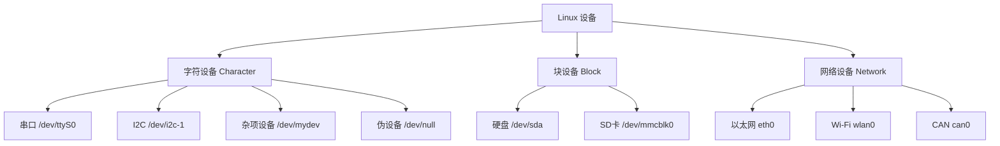

# 1 设备与字符设备编写

## 1.1 Linux的设备

#### 1.1.1 Linux设备层级

```
+---------------------+
|      用户空间        |  ← 应用程序 (open/read/write/ioctl)
+---------------------+
|   VFS (虚拟文件系统) |  ← 统一文件接口，调用 file_operations
+---------------------+
|   字符设备驱动层     |  ← 实现 .open/.read/.write 等回调（你的驱动代码）
+---------------------+
|   总线/控制器驱动    |  ← 如 I2C/SPI/UART 控制器驱动（platform_driver）
+---------------------+
|     硬件寄存器       |  ← SoC 上的外设（如 UART0、I2C1 控制器）
+---------------------+
|     外设硬件         |  ← 如温湿度传感器、EEPROM、LED
+---------------------+
```

#### 1.1.2 Linux设备分类




#### 1.1.3 设备与驱动层级举例

1. can设备

```
+-----------------------------+
|        用户空间              |
|  ┌───────────────────────┐  |
|  │     can-utils         │ ←─ 工具集（如 cansend, candump）
|  └───────────────────────┘  |
|        libc / socket API    |
+-----------------------------+
|        内核空间              |
|  ┌───────────────────────┐  |
|  │   CAN 协议栈 (net/can)│ ←─ 实现 ISO 11898 标准，提供 AF_CAN 套接字
|  └───────────────────────┘  |
|  ┌───────────────────────┐  |
|  │   CAN 控制器驱动       │ ←─ 如 mcp251x（SPI转CAN）、cc770（PCI/ISA）
|  └───────────────────────┘  |
|  ┌───────────────────────┐  |
|  │   硬件：CAN 控制器芯片 │ ←─ 如 MCP2515、SJA1000、SoC 内置 CAN 模块
|  └───────────────────────┘  |
+-----------------------------+
```

| 组件 | 所属层级 | 说明 |
|------|--------|------|
| CAN 控制器硬件 | 硬件层 | 如 MCP2515（SPI接口）、SJA1000（并行接口） |
| CAN 控制器驱动 | 内核驱动层 | 实现硬件寄存器操作，注册为网络设备 |
| SocketCAN 协议栈 | 内核网络子系统 | 提供 `AF_CAN` socket，处理帧过滤、错误处理等 |
| iproute2 (ip link) | 用户空间（配置工具） | 配置 CAN 接口比特率、模式等 |
| can-utils | 用户空间（应用工具） | 发送/接收/调试 CAN 帧 |

SocketCAN：将 CAN 总线抽象为 网络设备（如 can0），使用 AF_CAN 地址族的套接字 API

2. 蓝牙设备

注意：蓝牙（Bluetooth）设备在 Linux 系统中 不是单一类型的设备，而是由 多个内核子系统协同工作，最终向用户空间暴露为多种设备类型，具体取决于蓝牙的使用模式（如 HID、串口、音频等）。蓝牙本身没有统一的 /dev/bluetooth 设备文件。它的“设备类型”取决于上层协议和用途，底层由 BlueZ 协议栈统一管理。

| 蓝牙功能 | 用户空间可见设备类型 | 设备路径示例 | 所属内核子系统 |
|--------|------------------|-------------|--------------|
| 蓝牙 HCI 控制器（硬件接口） | 字符设备（通过 `AF_BLUETOOTH` socket 访问） | 无 `/dev` 节点，用 `hci0` 标识 | BlueZ + HCI Core |
| 蓝牙键盘/鼠标（HID） | 输入设备（Input Device） → 字符设备 | `/dev/input/eventX` | HID over Bluetooth |
| 蓝牙串口（SPP） | 伪 TTY 设备 → 字符设备 | `/dev/rfcomm0` 或 `/dev/ttyBLT0` | RFCOMM / TTY |
| 蓝牙音频（A2DP/HFP） | ALSA 音频设备 → 字符设备 | `/dev/snd/pcmCxDx` | BlueZ + ALSA/PulseAudio |
| BLE GATT 服务 | 通常通过 D-Bus API（非设备文件） | 无 `/dev` 节点 | BlueZ + D-Bus |

3. I2C/SPI字符设备

```
+-----------------------------+
|        用户空间              |
|  ┌───────────────────────┐  |
|  │    用户应用程序        │ ←─ open("/dev/i2c-1") 或使用 libi2c
|  └───────────────────────┘  |
+-----------------------------+
|        内核空间              |
|  ┌───────────────────────┐  |
|  │   I2C 核心层 (i2c-core)│ ←─ 提供 I2C 总线框架、设备注册/发现
|  └───────────────────────┘  |
|  ┌───────────────────────┐  |
|  │   I2C 控制器驱动       │ ←─ SoC 厂商提供（如 i2c-rk3x.c）
|  └───────────────────────┘  |
|  ┌───────────────────────┐  |
|  │   I2C 设备驱动 (client)│ ←─ 用户编写的具体设备驱动（如温湿度传感器）
|  └───────────────────────┘  |
+-----------------------------+
|        硬件                  |
|  ┌───────────────────────┐  |
|  │   SoC I2C 控制器       │ ←─ 如 I2C1 控制器
|  │   外设芯片             │ ←─ 如 BMP280、EEPROM
|  └───────────────────────┘  |
+-----------------------------+
```

| 组件 | 所属层级 | 设备类型 | 说明 |
|------|--------|---------|------|
| I2C 控制器 | 字符设备驱动层（用户接口） | 字符设备 | `/dev/i2c-0`、`/dev/i2c-1`，通过 `ioctl` 传输数据 |
| I2C 控制器驱动 | 总线/控制器驱动层 | platform_driver | 由 SoC 厂商提供，操作硬件寄存器 |
| I2C 设备驱动 | 字符设备驱动层 | 字符设备或 misc | 用户编写，通过 i2c_transfer 与设备通信 |

**重要区分：**
- **I2C 控制器驱动**：由 SoC 厂商提供（如 `i2c-rk3x.c`），实现底层硬件操作，通常不需要用户编写
- **I2C 设备驱动（client driver）**：用户需要编写的驱动，针对具体外设（如传感器、EEPROM）
- 用户也可以直接通过 `/dev/i2c-X` 使用 `ioctl` 与设备通信，无需编写内核驱动

4. 杂项设备（Miscellaneous Device）

杂项设备是字符设备的子集，主设备号固定为 10，使用 `misc_register()` 简化开发流程。

```
+-----------------------------+
|        用户空间              |
|  ┌───────────────────────┐  |
|  │    用户应用程序        │ ←─ open("/dev/my_misc_dev")
|  └───────────────────────┘  |
+-----------------------------+
|        内核空间              |
|  ┌───────────────────────┐  |
|  │   misc 子系统          │ ←─ 内核提供的杂项设备框架
|  └───────────────────────┘  |
|  ┌───────────────────────┐  |
|  │   misc 设备驱动        │ ←─ 使用 misc_register() 注册
|  └───────────────────────┘  |
+-----------------------------+
```

| 特性 | 标准字符设备 | 杂项设备 |
|-----|------------|---------|
| 主设备号 | 动态分配或静态指定 | 固定为 10 |
| 注册函数 | `alloc_chrdev_region` + `cdev_add` | `misc_register` |
| 设备节点 | 需手动创建或 class_create | 自动创建 |
| 适用场景 | 需要多个设备号、复杂驱动 | 简单设备、快速原型 |

**常见杂项设备示例：**
- `/dev/watchdog`：看门狗设备（主设备号 10，次设备号 130）
- `/dev/rtc`：实时时钟（主设备号 10，次设备号 135）
- `/dev/uinput`：用户空间输入设备（主设备号 10，次设备号 223）
- `/dev/hwrng`：硬件随机数生成器（主设备号 10，次设备号 183）

**伪设备**（也属于字符设备）：
- `/dev/null`：丢弃所有写入，读取返回 EOF
- `/dev/zero`：读取返回无限 `\0` 字节流
- `/dev/random`、`/dev/urandom`：随机数生成器
- `/dev/full`：写入返回 ENOSPC 错误

#### 1.1.4 驱动生命周期管理


**关键阶段说明：**

1. **初始化阶段（init）**
   - 动态或静态分配设备号（`alloc_chrdev_region` / `register_chrdev_region`）
   - 初始化并注册 cdev 结构（`cdev_init` + `cdev_add`）
   - 创建设备类和设备节点（`class_create` + `device_create`）
   - 初始化硬件、申请资源（内存、中断、IO内存等）

2. **运行阶段**
   - 处理用户空间的 `open`、`read`、`write`、`ioctl` 等系统调用
   - 管理并发访问（互斥锁、自旋锁）
   - 处理中断和异步事件

3. **清理阶段（exit）**
   - 释放所有已申请资源（逆序释放）
   - 销毁设备节点和设备类（`device_destroy` + `class_destroy`）
   - 注销 cdev（`cdev_del`）
   - 释放设备号（`unregister_chrdev_region`）

**资源管理最佳实践：**
- 使用 `devm_*` 系列函数（托管资源，自动释放）
- 在错误路径中确保所有已分配资源都被正确释放
- 遵循"后申请先释放"原则


## 1.2 Linux字符设备编写

#### 1.2.1 编写流程


**核心步骤：**

1. **定义 `file_operations` 结构**
   - 指定驱动支持的文件操作（`.open`、`.read`、`.write`、`.release`、`.ioctl` 等）

2. **实现回调函数**
   - `my_open`：初始化设备状态
   - `my_read`：从内核空间向用户空间传递数据（`copy_to_user`）
   - `my_write`：从用户空间向内核空间传递数据（`copy_from_user`）
   - `my_release`：清理设备状态
   - `my_ioctl`：设备控制命令

3. **模块初始化（`__init`）**
   - 动态分配设备号
   - 初始化 `cdev` 并关联 `file_operations`
   - 注册 `cdev` 到内核
   - 创建设备类和设备节点（自动创建 `/dev/xxx`）

4. **模块退出（`__exit`）**
   - 销毁设备节点和设备类
   - 注销 `cdev`
   - 释放设备号

5. **编写 Makefile**
   - 使用内核构建系统（Kbuild）


#### 1.2.2 编写示例

**完整字符设备驱动示例：**

```c
#include <linux/module.h>
#include <linux/kernel.h>
#include <linux/fs.h>
#include <linux/cdev.h>
#include <linux/device.h>
#include <linux/uaccess.h>
#include <linux/slab.h>

#define DEVICE_NAME "mychardev"
#define CLASS_NAME  "mychar"
#define BUFFER_SIZE 1024

MODULE_LICENSE("GPL");
MODULE_AUTHOR("Even");
MODULE_DESCRIPTION("A simple character device driver");
MODULE_VERSION("1.0");

static int major_number;
static struct class *device_class = NULL;
static struct device *device_dev = NULL;
static struct cdev my_cdev;

struct mychar_device {
    char *buffer;
    size_t buffer_size;
    struct mutex lock;
};

static struct mychar_device *mydev = NULL;

static int mychar_open(struct inode *inode, struct file *file)
{
    struct mychar_device *dev;
    
    dev = container_of(inode->i_cdev, struct mychar_device, cdev);
    file->private_data = dev;
    
    pr_info("mychardev: Device opened\n");
    return 0;
}

static int mychar_release(struct inode *inode, struct file *file)
{
    pr_info("mychardev: Device closed\n");
    return 0;
}

static ssize_t mychar_read(struct file *file, char __user *buf,
                           size_t count, loff_t *offset)
{
    struct mychar_device *dev = file->private_data;
    ssize_t bytes_read;
    
    if (mutex_lock_interruptible(&dev->lock))
        return -ERESTARTSYS;
    
    if (*offset >= dev->buffer_size) {
        mutex_unlock(&dev->lock);
        return 0;
    }
    
    if (*offset + count > dev->buffer_size)
        count = dev->buffer_size - *offset;
    
    if (copy_to_user(buf, dev->buffer + *offset, count)) {
        mutex_unlock(&dev->lock);
        return -EFAULT;
    }
    
    *offset += count;
    bytes_read = count;
    
    mutex_unlock(&dev->lock);
    pr_info("mychardev: Read %zd bytes\n", bytes_read);
    return bytes_read;
}

static ssize_t mychar_write(struct file *file, const char __user *buf,
                            size_t count, loff_t *offset)
{
    struct mychar_device *dev = file->private_data;
    ssize_t bytes_written;
    
    if (mutex_lock_interruptible(&dev->lock))
        return -ERESTARTSYS;
    
    if (*offset >= dev->buffer_size) {
        mutex_unlock(&dev->lock);
        return -ENOSPC;
    }
    
    if (*offset + count > dev->buffer_size)
        count = dev->buffer_size - *offset;
    
    if (copy_from_user(dev->buffer + *offset, buf, count)) {
        mutex_unlock(&dev->lock);
        return -EFAULT;
    }
    
    *offset += count;
    bytes_written = count;
    
    mutex_unlock(&dev->lock);
    pr_info("mychardev: Wrote %zd bytes\n", bytes_written);
    return bytes_written;
}

static loff_t mychar_llseek(struct file *file, loff_t offset, int whence)
{
    struct mychar_device *dev = file->private_data;
    loff_t new_offset;
    
    switch (whence) {
    case SEEK_SET:
        new_offset = offset;
        break;
    case SEEK_CUR:
        new_offset = file->f_pos + offset;
        break;
    case SEEK_END:
        new_offset = dev->buffer_size + offset;
        break;
    default:
        return -EINVAL;
    }
    
    if (new_offset < 0 || new_offset > dev->buffer_size)
        return -EINVAL;
    
    file->f_pos = new_offset;
    return new_offset;
}

static long mychar_ioctl(struct file *file, unsigned int cmd, unsigned long arg)
{
    struct mychar_device *dev = file->private_data;
    
    switch (cmd) {
    case 0x01:
        if (copy_to_user((void __user *)arg, dev->buffer, dev->buffer_size))
            return -EFAULT;
        break;
    case 0x02:
        if (copy_from_user(dev->buffer, (void __user *)arg, dev->buffer_size))
            return -EFAULT;
        break;
    default:
        return -ENOTTY;
    }
    
    return 0;
}

static struct file_operations fops = {
    .owner = THIS_MODULE,
    .open = mychar_open,
    .release = mychar_release,
    .read = mychar_read,
    .write = mychar_write,
    .llseek = mychar_llseek,
    .unlocked_ioctl = mychar_ioctl,
};

static int __init mychar_init(void)
{
    dev_t dev;
    int ret;
    
    mydev = kzalloc(sizeof(*mydev), GFP_KERNEL);
    if (!mydev) {
        pr_err("mychardev: Failed to allocate device structure\n");
        return -ENOMEM;
    }
    
    mydev->buffer = kzalloc(BUFFER_SIZE, GFP_KERNEL);
    if (!mydev->buffer) {
        pr_err("mychardev: Failed to allocate buffer\n");
        ret = -ENOMEM;
        goto fail_buffer;
    }
    mydev->buffer_size = BUFFER_SIZE;
    mutex_init(&mydev->lock);
    
    ret = alloc_chrdev_region(&dev, 0, 1, DEVICE_NAME);
    if (ret < 0) {
        pr_err("mychardev: Failed to allocate major number\n");
        goto fail_alloc;
    }
    major_number = MAJOR(dev);
    pr_info("mychardev: Registered with major number %d\n", major_number);
    
    cdev_init(&my_cdev, &fops);
    my_cdev.owner = THIS_MODULE;
    
    ret = cdev_add(&my_cdev, dev, 1);
    if (ret < 0) {
        pr_err("mychardev: Failed to add cdev\n");
        goto fail_cdev;
    }
    
    device_class = class_create(CLASS_NAME);
    if (IS_ERR(device_class)) {
        pr_err("mychardev: Failed to create device class\n");
        ret = PTR_ERR(device_class);
        goto fail_class;
    }
    
    device_dev = device_create(device_class, NULL, dev, NULL, DEVICE_NAME);
    if (IS_ERR(device_dev)) {
        pr_err("mychardev: Failed to create device\n");
        ret = PTR_ERR(device_dev);
        goto fail_device;
    }
    
    pr_info("mychardev: Device initialized successfully\n");
    return 0;
    
fail_device:
    class_destroy(device_class);
fail_class:
    cdev_del(&my_cdev);
fail_cdev:
    unregister_chrdev_region(dev, 1);
fail_alloc:
    kfree(mydev->buffer);
fail_buffer:
    kfree(mydev);
    return ret;
}

static void __exit mychar_exit(void)
{
    dev_t dev = MKDEV(major_number, 0);
    
    device_destroy(device_class, dev);
    class_destroy(device_class);
    cdev_del(&my_cdev);
    unregister_chrdev_region(dev, 1);
    
    if (mydev) {
        kfree(mydev->buffer);
        kfree(mydev);
    }
    
    pr_info("mychardev: Device unregistered\n");
}

module_init(mychar_init);
module_exit(mychar_exit);
```

**Makefile（标准 Kbuild 方式）：**

```makefile
obj-m += mychardev.o

KDIR := /lib/modules/$(shell uname -r)/build
PWD := $(shell pwd)

all:
	$(MAKE) -C $(KDIR) M=$(PWD) modules

clean:
	$(MAKE) -C $(KDIR) M=$(PWD) clean

install:
	$(MAKE) -C $(KDIR) M=$(PWD) modules_install
```

**用户空间测试程序：**

```c
#include <stdio.h>
#include <stdlib.h>
#include <fcntl.h>
#include <unistd.h>
#include <string.h>

#define DEVICE_PATH "/dev/mychardev"

int main()
{
    int fd;
    char write_buf[] = "Hello, Character Device!";
    char read_buf[100];
    ssize_t bytes;
    
    fd = open(DEVICE_PATH, O_RDWR);
    if (fd < 0) {
        perror("Failed to open device");
        return EXIT_FAILURE;
    }
    
    bytes = write(fd, write_buf, strlen(write_buf));
    printf("Wrote %zd bytes: %s\n", bytes, write_buf);
    
    lseek(fd, 0, SEEK_SET);
    
    bytes = read(fd, read_buf, sizeof(read_buf) - 1);
    read_buf[bytes] = '\0';
    printf("Read %zd bytes: %s\n", bytes, read_buf);
    
    close(fd);
    return EXIT_SUCCESS;
}
```

#### 1.2.3 示例解读（逐模块/逐行）

**1. 头文件与模块信息**

```c
#include <linux/module.h>    // 核心模块功能（MODULE_LICENSE等）
#include <linux/fs.h>        // 文件操作结构、设备号
#include <linux/cdev.h>      // cdev 结构与操作
#include <linux/device.h>    // class_create/device_create
#include <linux/uaccess.h>   // copy_to_user/copy_from_user
#include <linux/slab.h>      // kmalloc/kfree（内核内存分配）
```

**2. 设备数据结构**

```c
struct mychar_device {
    char *buffer;          // 设备缓冲区
    size_t buffer_size;    // 缓冲区大小
    struct mutex lock;     // 互斥锁（保护并发访问）
};
```

每个打开的设备文件共享同一设备状态，使用互斥锁保护并发读写。

**3. file_operations 结构**

```c
static struct file_operations fops = {
    .owner = THIS_MODULE,          // 防止模块在使用时被卸载
    .open = mychar_open,           // 打开设备
    .release = mychar_release,     // 关闭设备
    .read = mychar_read,           // 读取数据
    .write = mychar_write,         // 写入数据
    .llseek = mychar_llseek,       // 移动文件指针
    .unlocked_ioctl = mychar_ioctl,// 设备控制
};
```

这是字符设备的核心，将系统调用映射到驱动函数。

**4. open/release 回调**

```c
static int mychar_open(struct inode *inode, struct file *file)
{
    // container_of 从 cdev 获取设备结构指针
    struct mychar_device *dev = container_of(inode->i_cdev, 
                                             struct mychar_device, cdev);
    file->private_data = dev;  // 保存供后续操作使用
    return 0;
}
```

- `inode->i_cdev`：指向内核中的 cdev 结构
- `file->private_data`：每次系统调用都可访问此指针

**5. read 回调（内核→用户空间）**

```c
if (copy_to_user(buf, dev->buffer + *offset, count))
    return -EFAULT;
```

- `copy_to_user`：安全地将数据从内核空间拷贝到用户空间
- 返回非零值表示拷贝失败，必须返回 `-EFAULT`

**6. write 回调（用户空间→内核）**

```c
if (copy_from_user(dev->buffer + *offset, buf, count))
    return -EFAULT;
```

- `copy_from_user`：安全地将数据从用户空间拷贝到内核空间
- 防止用户传递非法指针导致内核崩溃

**7. 模块初始化（关键步骤）**

```c
// 步骤1：动态分配设备号
ret = alloc_chrdev_region(&dev, 0, 1, DEVICE_NAME);
major_number = MAJOR(dev);  // 提取主设备号

// 步骤2：初始化 cdev
cdev_init(&my_cdev, &fops);
my_cdev.owner = THIS_MODULE;

// 步骤3：注册 cdev
ret = cdev_add(&my_cdev, dev, 1);

// 步骤4：创建设备类（/sys/class/mychar）
device_class = class_create(CLASS_NAME);

// 步骤5：创建设备节点（/dev/mychardev）
device_dev = device_create(device_class, NULL, dev, NULL, DEVICE_NAME);
```

**8. 错误处理（资源释放）**

```c
fail_device:
    class_destroy(device_class);
fail_class:
    cdev_del(&my_cdev);
fail_cdev:
    unregister_chrdev_region(dev, 1);
fail_alloc:
    kfree(mydev->buffer);
fail_buffer:
    kfree(mydev);
```

使用 `goto` 标签实现"跳转到已分配资源的释放点"，确保任何失败路径都不会泄漏资源。

**9. 模块退出（逆序释放）**

```c
device_destroy(device_class, dev);  // 销毁设备节点
class_destroy(device_class);        // 销毁设备类
cdev_del(&my_cdev);                 // 注销 cdev
unregister_chrdev_region(dev, 1);   // 释放设备号
kfree(mydev->buffer);               // 释放缓冲区
kfree(mydev);                       // 释放设备结构
```

释放顺序与初始化顺序相反。

#### 1.2.4 编译、测试与验证方法

**Linux 内核模块标准构建方式：Makefile + Kbuild**

```bash
# 编译模块
make

# 清理构建文件
make clean

# 安装模块到系统（可选）
sudo make install
sudo depmod -a
```

**测试流程：**

```bash
# 1. 加载模块
sudo insmod mychardev.ko

# 2. 查看模块加载日志，获取主设备号
dmesg | tail
# 输出示例：mychardev: Registered with major number 240

# 3. 确认设备节点已自动创建
ls -l /dev/mychardev
# 输出示例：crw-rw---- 1 root root 240, 0 Mar 25 10:00 /dev/mychardev

# 4. 修改设备权限（或使用 sudo）
sudo chmod 666 /dev/mychardev

# 5. 使用 echo/cat 测试
echo "Hello Driver" > /dev/mychardev
cat /dev/mychardev

# 6. 编译并运行测试程序
gcc -o test_mychardev test_mychardev.c
./test_mychardev

# 7. 查看内核日志
dmesg | tail

# 8. 卸载模块
sudo rmmod mychardev
```

**调试方法：**

```bash
# 查看 /sys 接口
ls /sys/class/mychar/
cat /sys/class/mychar/mychardev/dev

# 查看模块信息
modinfo mychardev.ko

# 查看已加载模块
lsmod | grep mychardev

# 动态调试（需启用 CONFIG_DYNAMIC_DEBUG）
echo "module mychardev +p" > /sys/kernel/debug/dynamic_debug/control

# 使用 ftrace 跟踪函数调用
echo mychar_open > /sys/kernel/debug/tracing/set_ftrace_filter
echo function > /sys/kernel/debug/tracing/current_tracer
cat /sys/kernel/debug/tracing/trace
```

**CMake 构建方式（非常规，仅供参考）：**

若项目需要使用 CMake，可参考以下配置，但需注意这是非标准方式：

```cmake
cmake_minimum_required(VERSION 3.10)
project(mychardev C)

set(KERNEL_DIR "/lib/modules/${CMAKE_SYSTEM_NAME}/build")
set(MODULE_NAME "mychardev")

add_custom_command(
    OUTPUT ${MODULE_NAME}.ko
    COMMAND make -C ${KERNEL_DIR} M=${CMAKE_CURRENT_SOURCE_DIR} modules
    DEPENDS ${MODULE_NAME}.c
    WORKING_DIRECTORY ${CMAKE_CURRENT_SOURCE_DIR}
)

add_custom_target(driver ALL DEPENDS ${MODULE_NAME}.ko)
```

#### 1.3 通用平台与嵌入式平台驱动对比

| 特性 | 通用平台（x86/x64） | 嵌入式平台（ARM/RISC-V） |
|-----|------------------|----------------------|
| **设备发现机制** | ACPI、PCI 自动枚举 | 设备树（Device Tree） |
| **资源获取** | 动态探测（PCI配置空间） | 从 DT 获取（`of_*` 函数） |
| **内存管理** | 充足，使用 `kmalloc` | 约束，优先 `devm_kzalloc` |
| **电源管理** | APM/ACPI | Runtime PM、suspend/resume |
| **调试手段** | GDB、ftrace、perf | printk + 串口、JTAG |
| **实时性要求** | 一般 | 可能需要 PREEMPT_RT |
| **构建系统** | 标准内核源码树 | 交叉编译、厂商 SDK |

**1. 设备树支持（嵌入式标配）**

```c
static const struct of_device_id mychar_of_match[] = {
    { .compatible = "vendor,mychardev", },
    { /* sentinel */ }
};
MODULE_DEVICE_TABLE(of, mychar_of_match);

static struct platform_driver mychar_driver = {
    .probe = mychar_probe,
    .remove = mychar_remove,
    .driver = {
        .name = "mychardev",
        .of_match_table = mychar_of_match,
    },
};

module_platform_driver(mychar_driver);
```

设备树节点（DTS）：

```dts
mychardev@0 {
    compatible = "vendor,mychardev";
    reg = <0x10000000 0x1000>;
    interrupts = <0 42 4>;
};
```

**2. 资源管理差异**

```c
// 嵌入式：使用托管资源（自动释放）
mydev = devm_kzalloc(&pdev->dev, sizeof(*mydev), GFP_KERNEL);
ret = devm_request_irq(&pdev->dev, irq, my_isr, 0, "mydev", mydev);

// 通用平台：手动管理
mydev = kzalloc(sizeof(*mydev), GFP_KERNEL);
ret = request_irq(irq, my_isr, 0, "mydev", mydev);
```

**3. 电源管理**

```c
#ifdef CONFIG_PM_SLEEP
static int mychar_suspend(struct device *dev)
{
    // 进入低功耗模式
    return 0;
}

static int mychar_resume(struct device *dev)
{
    // 恢复正常工作模式
    return 0;
}

static SIMPLE_DEV_PM_OPS(mychar_pm_ops, mychar_suspend, mychar_resume);
#endif

// 在 driver 结构中引用
.driver = {
    .pm = &mychar_pm_ops,
}
```

**4. 调试手段对比**

| 调试方法 | 通用平台 | 嵌入式平台 |
|---------|---------|----------|
| printk | ✅ dmesg | ✅ 串口输出 |
| GDB | ✅ kgdb/kdb | ⚠️ 需 JTAG |
| ftrace | ✅ | ✅ |
| perf | ✅ | ⚠️ 受限 |
| dynamic_debug | ✅ | ✅ |

**嵌入式推荐调试流程：**

```bash
# 1. 增加日志级别
echo "8 4 1 7" > /proc/sys/kernel/printk

# 2. 启用动态调试
echo "module mychardev +p" > /sys/kernel/debug/dynamic_debug/control

# 3. 使用 ftrace 跟踪
echo function > /sys/kernel/debug/tracing/current_tracer
echo mychar_* > /sys/kernel/debug/tracing/set_ftrace_filter
cat /sys/kernel/debug/tracing/trace_pipe

# 4. 通过串口查看实时日志
minicom -D /dev/ttyUSB0 -b 115200
```


