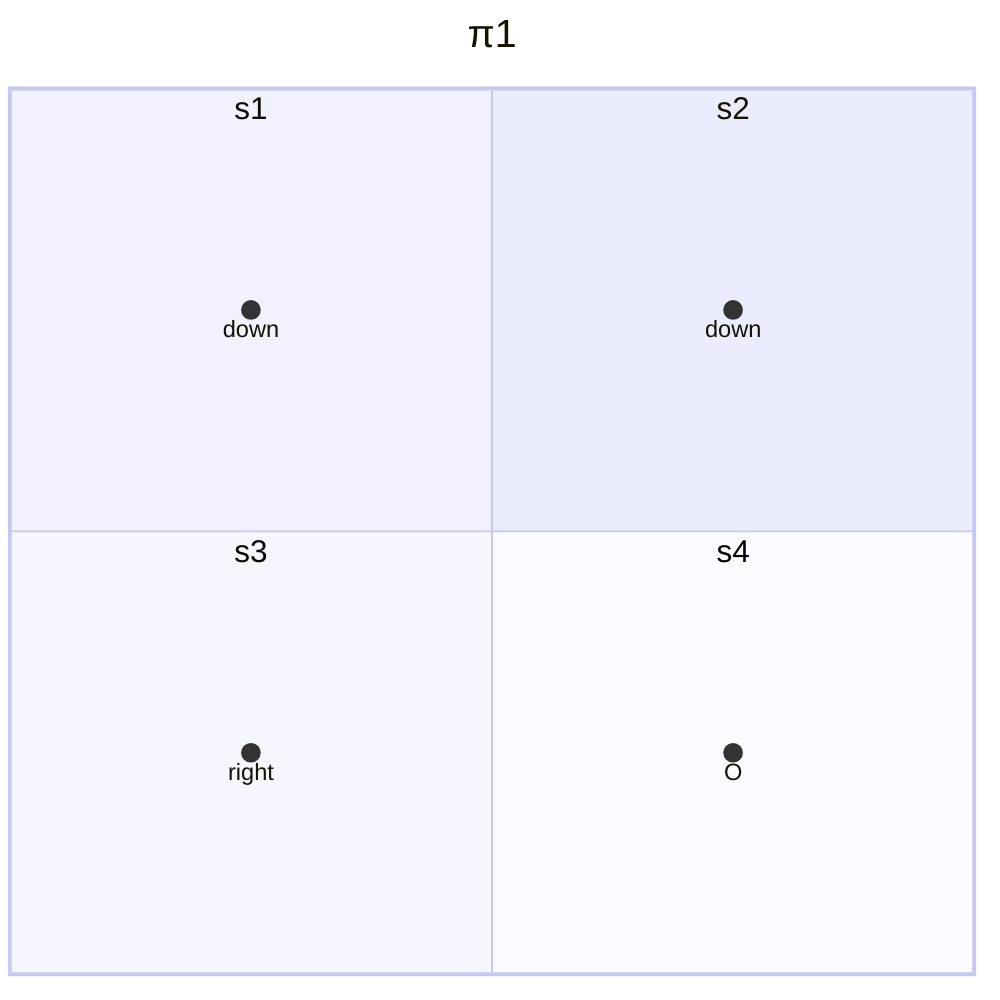
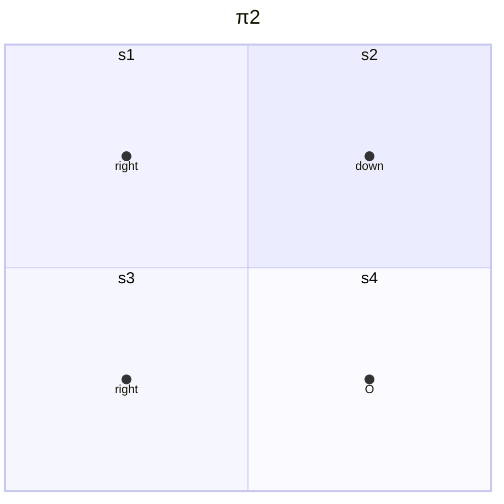
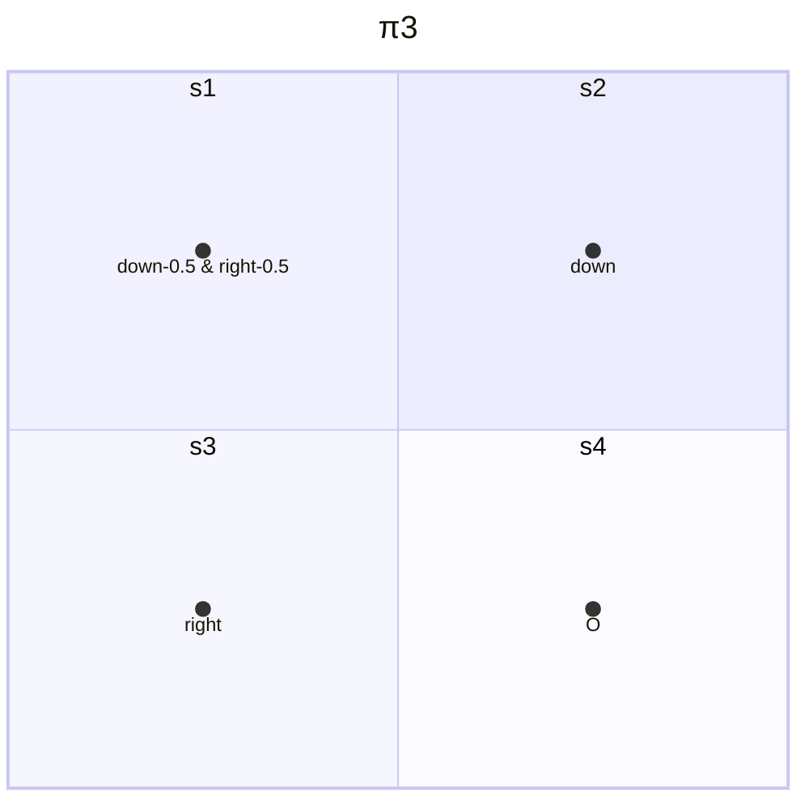
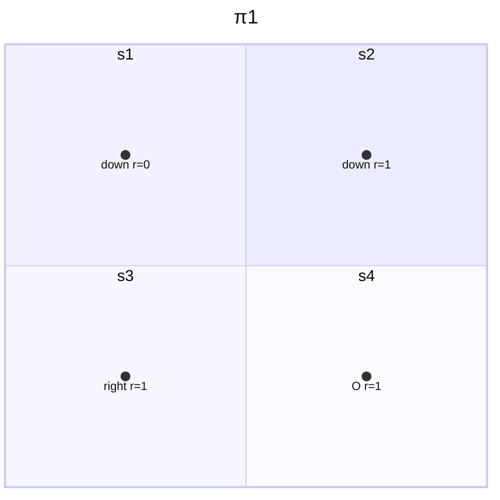
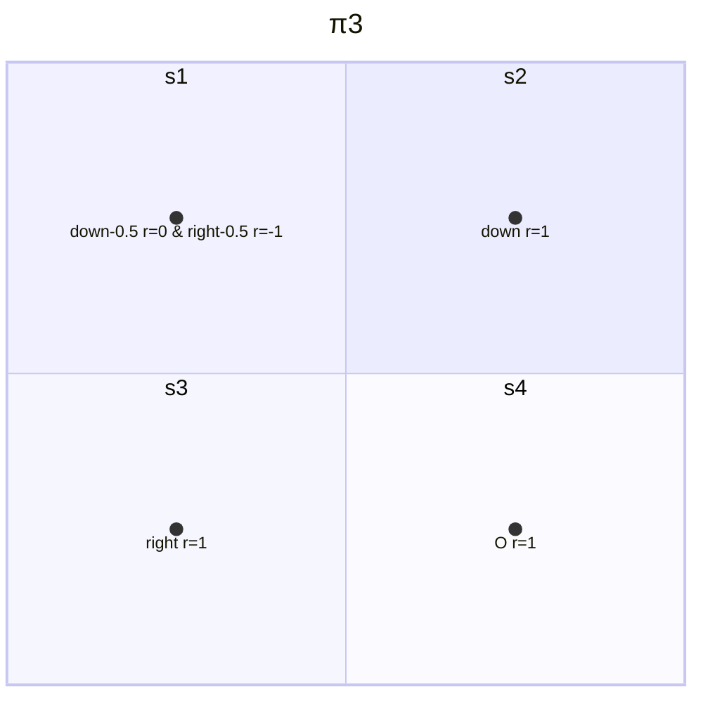

# 2 贝尔曼公式

## 2.1 Motivating examples

- 三个例子

- 为什么return是重要的？
    - return被用于评估策略的好坏，量化后才能评估
    - stochastic policy情况下reutrn可以求期望

- 如何计算return？
    - 通过定义计算
    - 通过$\mathbf{v}=\mathbf{r}+\gamma\mathbf{P}\mathbf{v}$ ：Bootstrapping（自举）或者说自我迭代得到，其中$\mathbf{v}=\text{value},\mathbf{r}=\text{reward},\gamma=\text{discounted rate},\mathbf{P}=\text{parameters}$
    - 以上即为Bellman equation（贝尔曼公式），原理就是一个状态的value依赖于其他状态的value

## 2.2 State value

$$S_t\xrightarrow{A_t}R_{t+1},S_{t+1}$$
- 以上为单步的过程，其中
    - $t,t+1$为离散时间变量
    - $S_t$为$t$时刻的状态
    - $A_t$为$S_t$状态时采取的action
    - $R_{t+1}$为采取$A_t$后获得的reward，也有写作$R_t$的情况
    - $S_{t+1}$为采取$A_t$后转变到的状态
    - $S_t,A_t,R_{t+1}$均为随机变量，因此可以做求期望等操作

- 上述过程中的下列映射由谁决定？
    - $S_t\to A_t$由$\pi(A_t=a|S_t=s)$决定
    - $S_t,A_t\to R_{t+1}$由$p(R_{t+1}=r|S_t=s,A_t=a)$决定
    - $S_t,A_t\to S_{t+1}$由$p(S_{t+1}=s'|S_t=s,A_t=a)$决定
    - 此时我们认为模型是已知的

- 单步过程可以推广为多步的trajectory
    - $S_t\xrightarrow{A_t}R_{t+1},S_{t+1}\xrightarrow{A_{t+1}}R_{t+2},S_{t+2}\xrightarrow{A_{t+2}}R_{t+3},...$
    - $\text{discounted return}$是$G_t=R_{t+1}+\gamma R_{t+2}+\gamma^2R_{t+3}+...$
    - $\gamma \in [0,1)$是discount rate
    - $G_t$也是随机变量

- 定义state value
    - state value就是$G_t$的期望值
    - 数学表示为$v_{\pi}(s)=\mathbb{E}[G_t|S_t=s]$
    - 是$s$的函数，从不同$s$出发得到的state value不同
    - 是$\pi$的函数，采取不同策略$\pi$得到的state value不同
    - 若从一个状态出发，存在多个trajectory，那么return和state value可能不同
    - 若从一个状态出发，只有一个trajectory，那么return和state value就是一样的，相当于概率为1

- 三个例子的计算
    - $v_{\pi_1}(s_1)=0+\gamma1+\gamma^21+\cdots=\gamma(1+\gamma+\gamma^2+\ldots)=\frac{\gamma}{1-\gamma}$
    - $v_{\pi_2}(s_1)=-1+\gamma1+\gamma^21+\cdots=-1+\gamma(1+\gamma+\gamma^2+\ldots)=-1+\frac{\gamma}{1-\gamma}$
    - $v_{\pi_3}(s_1)=0.5\left(-1+\frac{\gamma}{1-\gamma}\right)+0.5\left(\frac{\gamma}{1-\gamma}\right)=-0.5+\frac{\gamma}{1-\gamma}$
    - 易得策略$\pi_1$是最优的，$\pi_3$次之，$\pi_2$最差

## 2.3 Bellman equation derivation

- 推导过程
    - 考虑trajectory
    $$ S_t\xrightarrow{A_t}R_{t+1},S_{t+1}\xrightarrow{A_{t+1}}R_{t+2},S_{t+2}\xrightarrow{A_{t+2}}R_{t+3},...$$

    - 其discounted return是
    $$\begin{aligned}
        G_t &= R_{t+1}+\gamma R_{t+2} + \gamma^2 R_{t+3} + ...,\\ 
        &= R_{t+1} + \gamma(R_{t+2}+\gamma R_{t+3} + ...), \\
        &= R_{t+1} + \gamma G_{t+1}
    \end{aligned}$$

    - 因此state value可计算如下
    $$\begin{aligned}
        v_{\pi}(s)&=\mathbb{E}[G_t|S_t=s] \\ 
        &=\mathbb{E}[R_{t+1}+\gamma G_{t+1}|S_t=s] \\
        &=\mathbb{E}[R_{t+1}|S_t=s] + \gamma \mathbb{E}[G_{t+1}|S_t=s]
    \end{aligned}$$

    - 其中第一项表示immediate rewards的期望
    $$\begin{aligned}
        \mathbb{E}[R_{t+1}|S_t=s]&=\sum_a\pi(a|s)\mathbb{E}[R_{t+1}|S_t=s,A_t=a] \\
        &=\sum_a\pi(a|s)\sum_r p(r|s,a)r
    \end{aligned}$$

    - 第二项表示future rewards的期望，第一步化简理由就是马尔可夫性质
    $$\begin{aligned}
        \mathbb{E}[G_{t+1}|S_t=s]&=\sum_{s'}\mathbb{E}[G_{t+1}|S_t=s,S_{t+1}=s']p(s'|s) \\
        &=\sum_{s'}\mathbb{E}[G_{t+1}|S_{t+1}=s']p(s'|s) \\
        &=\sum_{s'}v_{\pi}(s')p(s'|s) \\
        &=\sum_{s'}v_{\pi}(s')\sum_a p(s'|s,a)\pi(a|s)
    \end{aligned}$$

    - 因此可以得到贝尔曼公式(Bellman equation)表达式如下，该公式描述了**不同状态的state-value关系**
    $$\begin{aligned}
        v_{\pi}(s) &=  \mathbb{E}[G_t|S_t=s] \\
        &=\sum_a\pi(a|s)\sum_r p(r|s,a)r+\gamma\sum_{a}\pi(a|s)\sum_{s'} p(s'|s,a)v_{\pi}(s') \\
        &=\sum_a\pi(a|s)\left[\sum_r p(r|s,a)r+\gamma\sum_{s'} p(s'|s,a)v_{\pi}(s')\right], \quad \forall s \in \mathcal{S}.
    \end{aligned}$$

- 贝尔曼公式的几个重要符号含义
    - $v_{\pi}(s)$ 和 $v_{\pi}(s')$是**待计算的值**，通过Bootstrapping计算（一组贝尔曼公式联立）
    - $\pi(a|s)$是一个给定的策略，是一个**概率**。求解贝尔曼方程就是策略评估的过程。
    - $p(r|s,a)$和$p(s'|s,a)$也是**概率**，表示dynamic model，model可以是已知或未知的，有不同的方法来求解state value

- 代入示例
    - 在$s_1$的state value $v_{\pi}(s_1)=1\times[0+\gamma(1\times v_{\pi}(s_3))]=0+\gamma v_{\pi}(s_3)$
    - 同理可得$v_{\pi}(s_2)=1+\gamma v_{\pi}(s_4)$
    - $v_{\pi}(s_3)=1+\gamma v_{\pi}(s_4)$
    - $v_{\pi}(s_4)=1+\gamma v_{\pi}(s_4)$

    - 联立上述方程，可得
    $$\begin{cases}
        v_{\pi}(s_1)=0+\gamma v_{\pi}(s_3) \\
        v_{\pi}(s_2)=1+\gamma v_{\pi}(s_4) \\
        v_{\pi}(s_3)=1+\gamma v_{\pi}(s_4) \\
        v_{\pi}(s_4)=1+\gamma v_{\pi}(s_4)
    \end{cases}$$
    
    - 解得
    $$\begin{aligned}
         v_{\pi}(s_4)&=\dfrac{1}{1-\gamma} \\
         v_{\pi}(s_3)&=\dfrac{1}{1-\gamma} \\
         v_{\pi}(s_2)&=\dfrac{1}{1-\gamma} \\
         v_{\pi}(s_1)&=\dfrac{\gamma}{1-\gamma}
    \end{aligned}$$

    - 若$\gamma = 0.9$，可得
    $$\begin{aligned}
         v_{\pi}(s_4)&=\dfrac{1}{1-0.9}=10 \\
         v_{\pi}(s_3)&=\dfrac{1}{1-0.9}=10 \\
         v_{\pi}(s_2)&=\dfrac{1}{1-0.9}=10 \\
         v_{\pi}(s_1)&=\dfrac{0.9}{1-0.9}=9
    \end{aligned}$$

    - state value表示state的价值，在上述计算中，$s_1$的价值较低，因为其离目标state较远，因此是合理的。通过这个可以去迭代优化policy

- 第二个示例
    - 贝尔曼方程形式
    $$v_{\pi}(s)=\sum_a\pi(a|s)\left[\sum_rp(r|s,a)r+\gamma\sum_{s'}p(s'|s,a)v_{\pi}(s')\right]$$
    - 首先计算并联立贝尔曼方程
    $$\begin{cases}
        v_{\pi}(s_1) = 0.5[0+\gamma\cdot 0.5v_{\pi}(s_2)] + 0.5[-1+\gamma\cdot 0.5v_{\pi}(s_3)]=0.25\gamma v_{\pi}(s_2) + 0.25\gamma v_{\pi}(s_3) - 0.5 \\
        v_{\pi}(s_2) = 1\cdot[1\times1+\gamma(1\cdot v_{\pi}(s_4))]=1+\gamma v_{\pi}(s_4)\\
        v_{\pi}(s_3) = 1\cdot[1\times1+\gamma(1\cdot v_{\pi}(s_4))]=1+ \gamma v_{\pi}(s_4) \\
        v_{\pi}(s_4) = 1\cdot[1\times1+\gamma(1\cdot v_{\pi}(s_4))] = 1+ \gamma v_{\pi}(s_4)
    \end{cases}$$
    - 求解联立的方程可得
    $$\begin{aligned}
        v_{\pi}(s_4) &= \dfrac{1}{1-\gamma} \\
        v_{\pi}(s_3) &= \dfrac{1}{1-\gamma} \\
        v_{\pi}(s_2) &= \dfrac{1}{1-\gamma} \\
        v_{\pi}(s_1) &= -0.5+\dfrac{\gamma}{1-\gamma}
    \end{aligned}$$
    - 设$\gamma=0.9$，代入以上结果得
    $$\begin{aligned}
        v_{\pi}(s_4) &= 10 \\
        v_{\pi}(s_3) &= 10 \\
        v_{\pi}(s_2) &= 10 \\
        v_{\pi}(s_1) &= -0.5+9 = 8.5
    \end{aligned}$$
    - 比较先前的policy，可见结果较差