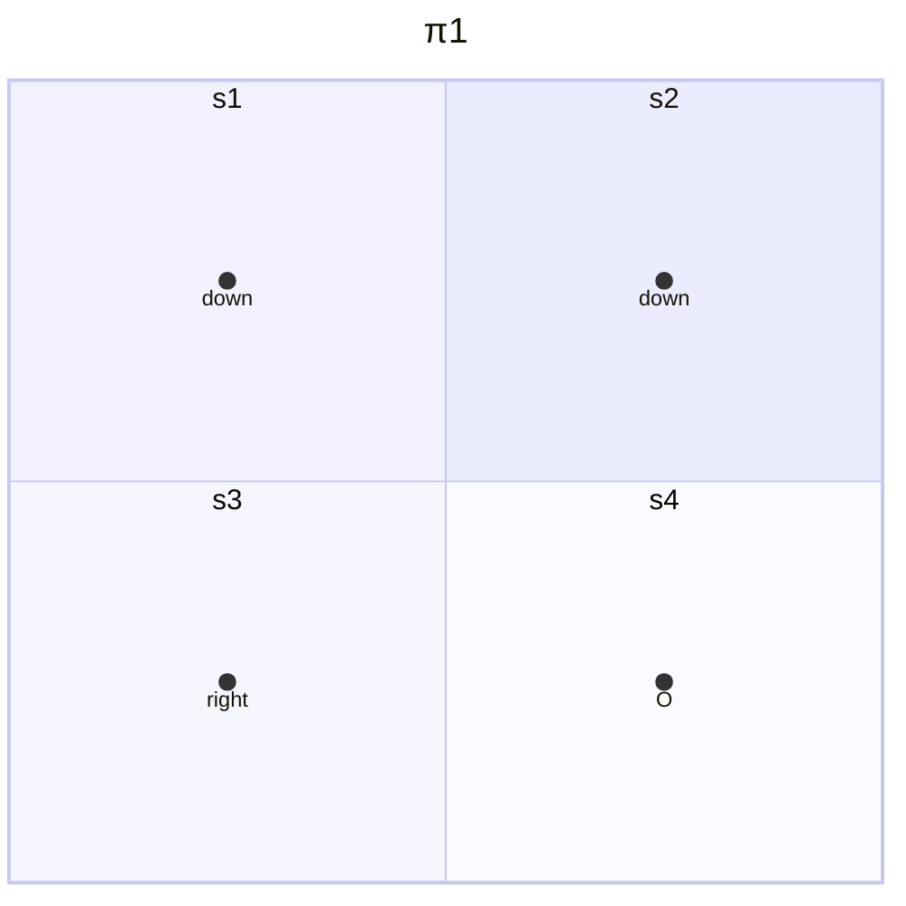
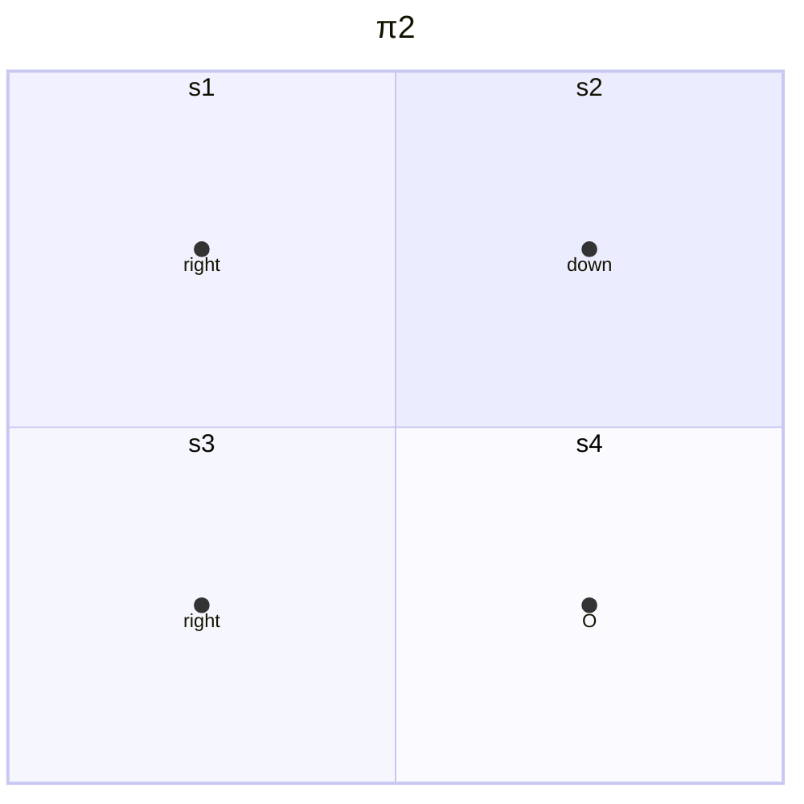
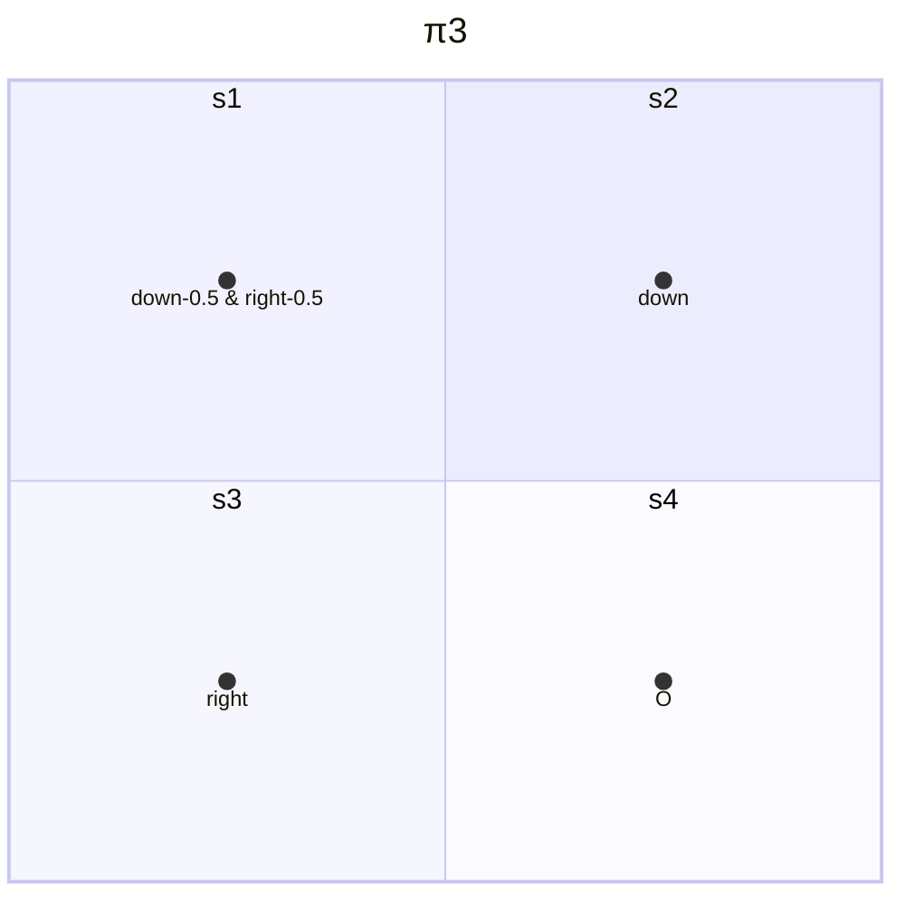

# 2 贝尔曼公式

## 2.1 Motivating examples

- 三个例子

- 为什么return是重要的？
    - return被用于评估策略的好坏，量化后才能评估
    - stochastic policy情况下reutrn可以求期望

- 如何计算return？
    - 通过定义计算
    - 通过$\mathbf{v}=\mathbf{r}+\gamma\mathbf{P}\mathbf{v}$ ：Bootstrapping（自举）或者说自我迭代得到，其中$\mathbf{v}=\text{value},\mathbf{r}=\text{reward},\gamma=\text{discounted rate},\mathbf{P}=\text{parameters}$
    - 以上即为Bellman equation（贝尔曼公式），原理就是一个状态的value依赖于其他状态的value

## 2.2 State value

$$S_t\xrightarrow{A_t}R_{t+1},S_{t+1}$$
- 以上为单步的过程，其中
    - $t,t+1$为离散时间变量
    - $S_t$为$t$时刻的状态
    - $A_t$为$S_t$状态时采取的action
    - $R_{t+1}$为采取$A_t$后获得的reward，也有写作$R_t$的情况
    - $S_{t+1}$为采取$A_t$后转变到的状态
    - $S_t,A_t,R_{t+1}$均为随机变量，因此可以做求期望等操作

- 上述过程中的下列映射由谁决定？
    - $S_t\to A_t$由$\pi(A_t=a|S_t=s)$决定
    - $S_t,A_t\to R_{t+1}$由$p(R_{t+1}=r|S_t=s,A_t=a)$决定
    - $S_t,A_t\to S_{t+1}$由$p(S_{t+1}=s'|S_t=s,A_t=a)$决定
    - 此时我们认为模型是已知的

- 单步过程可以推广为多步的trajectory
    - $S_t\xrightarrow{A_t}R_{t+1},S_{t+1}\xrightarrow{A_{t+1}}R_{t+2},S_{t+2}\xrightarrow{A_{t+2}}R_{t+3},...$
    - $\text{discounted return}$是$G_t=R_{t+1}+\gamma R_{t+2}+\gamma^2R_{t+3}+...$
    - $\gamma \in [0,1)$是discount rate
    - $G_t$也是随机变量

- 定义state value
    - state value就是$G_t$的期望值
    - 数学表示为$v_{\pi}(s)=\mathbb{E}[G_t|S_t=s]$
    - 是$s$的函数，从不同$s$出发得到的state value不同
    - 是$\pi$的函数，采取不同策略$\pi$得到的state value不同
    - 若从一个状态出发，存在多个trajectory，那么return和state value可能不同
    - 若从一个状态出发，只有一个trajectory，那么return和state value就是一样的，相当于概率为1

- 三个例子的计算
    - $v_{\pi_1}(s_1)=0+\gamma1+\gamma^21+\cdots=\gamma(1+\gamma+\gamma^2+\ldots)=\frac{\gamma}{1-\gamma}$
    - $v_{\pi_2}(s_1)=-1+\gamma1+\gamma^21+\cdots=-1+\gamma(1+\gamma+\gamma^2+\ldots)=-1+\frac{\gamma}{1-\gamma}$
    - $v_{\pi_3}(s_1)=0.5\left(-1+\frac{\gamma}{1-\gamma}\right)+0.5\left(\frac{\gamma}{1-\gamma}\right)=-0.5+\frac{\gamma}{1-\gamma}$
    - 易得策略$\pi_1$是最优的，$\pi_3$次之，$\pi_2$最差