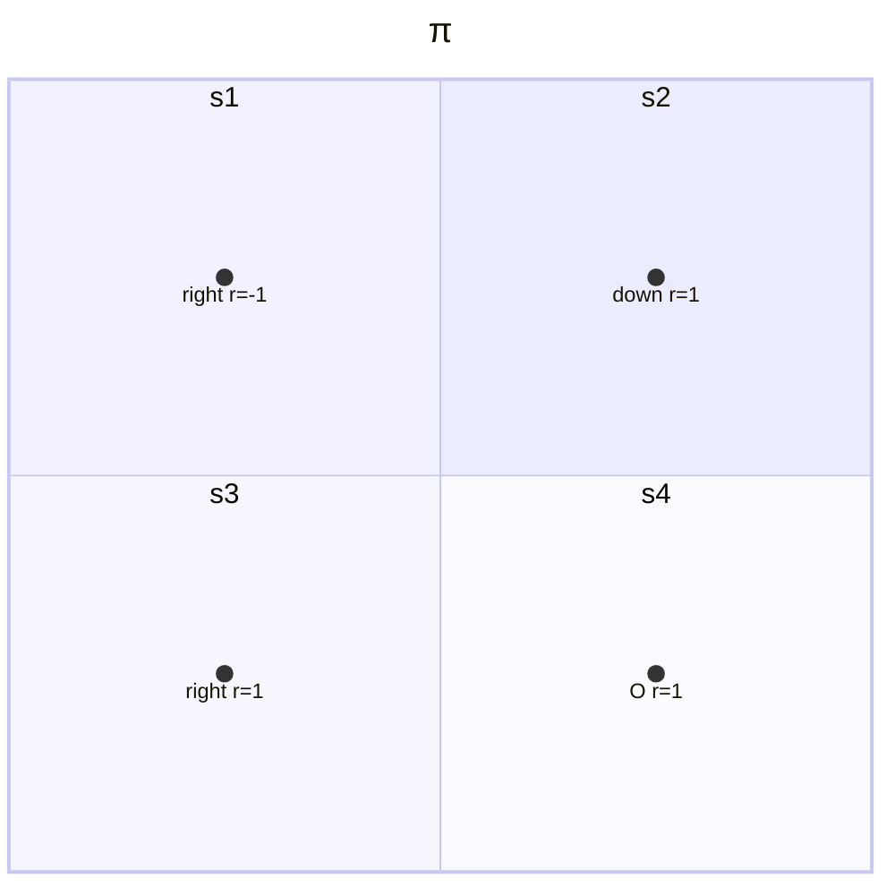

# 3 贝尔曼最优公式

- Bellman Opetimality Equation Keypoints
    - Core Concepts: optimal state value and optimal policy
    - A fundamental tool: the Bellman optimalizy euqation(BOE)

## 3.1 Motivating examples

- In case $\pi$
    - Bellman quation
    $$\begin{aligned}
        v_\pi(s_1)&=-1+\gamma v_\pi(s_2) \\
        v_\pi(s_2)&=+1+\gamma v_\pi(s_4) \\
        v_\pi(s_3)&=+1+\gamma v_\pi(s_4) \\
        v_\pi(s_4)&=+1+\gamma v_\pi(s_4)
    \end{aligned}$$
    - State value: let $\gamma=0.9$，则
    $$v_\pi(s_4)=v_\pi(s_3)=v_\pi(s_2)=10, \quad v_\pi(s_1)=8$$
    - Action value: consider $s_1$
    $$\begin{aligned}
        q_\pi(s_1,a_1)&=-1+\gamma v_\pi(s_1)=6.2 \\
        q_\pi(s_1,a_2)&=-1+\gamma v_\pi(s_2)=8 \\
        q_\pi(s_1,a_3)&=0+\gamma v_\pi(s_3)=9 \\
        q_\pi(s_1,a_4)&=-1+\gamma v_\pi(s_1)=6.2 \\
        q_\pi(s_1,a_5)&=0+\gamma v_\pi(s_1)=7.2
    \end{aligned}$$
    - 当前策略不够好，如何改进？利用Action value！
    - 当前策略$\pi(a|s_1)$可以写成如下形式
    $$\pi(a|s_1)=\begin{cases}
        1\qquad a=a_2 \\ 0 \qquad a\neq a_2
    \end{cases}$$
    - 观察计算的Action values可以发现在$s_1$处$a_3$的action value最大，那么可以尝试采用$a_3$作为当前策略，即
    $$\pi_{new}(a|s_1)=\begin{cases}
        1 \qquad a=a^\ast \\ 0 \qquad a\neq a^\ast
    \end{cases}$$
    - 其中$a^\ast=\text{argmax}_a q_\pi(s_1,a)=a_3$
    - 为什么重复选择（迭代）可以得到最优策略？直观上不好理解，但贝尔曼最优公式可以从数学角度回答。

## 3.2 Optimal policy

- 定义state value的好坏
    - 如果一个策略满足
    $$v_{\pi_1}(s)\geq v_{\pi_2} \qquad \text{for all}\quad s\in\mathcal{S}$$
    - 那么可以说$\pi_1$优于$\pi_2$
    - 则定义最优策略为：策略$\pi^\ast$在当$v_{\pi^\ast}(s)\geq v_\pi(s)$对于任何状态$s$和任何其他策略$\pi$都成立，则策略$\pi^\ast$是最优策略
    - 由最优策略引出的问题
        - 最优策略是否存在？
        - 最优策略是否唯一？
        - 最优策略是随机性还是确定性的？
        - 如何得到最优策略？
    - 通过研究贝尔曼最优公式来回答上述问题

- 贝尔曼最优公式(Bellman Optimal Equation, BOE)
    - 元素形式
    $$\begin{aligned}
      v(s)&=\max_\pi \sum_a\pi(a|s)\left(\sum_r p(r|s,a)r+\gamma\sum_{s'} p(s'|s,a)v(s')\right),\quad\forall s\in \mathcal{S} \\ &= \max_\pi \sum_a\pi(a|s)q(s,a)\quad s\in\mathcal{S}
    \end{aligned}$$
    - 分析
        - $p(r|s,a),p(s'|s,a)$已知
        - $v(s),v(s')$未知但可计算
        - $\pi(s)$是否可知？
    - 矩阵-向量形式
    $$v=\max_\pi(r_\pi+\gamma P_\pi v)$$
    - 其中
    $$[r_\pi]_s\triangleq\sum_a\pi(a|s)\sum_r p(r|s,a)r$$
    $$[P_\pi]_{s,s'}=p(s'|s)\triangleq\sum_a\pi(a|s)\sum_{s'} p(s'|s,a)$$
    - 此处$\max_\pi$操作是对矩阵的每一个元素做的
    - 形式简洁，内涵丰富（最优化问题）

- BOE右侧表达式的最大值
    - 求解
    $$v(s)=\max_\pi \sum_a\pi(a|s)\left(\sum_r p(r|s,a)r+\gamma\sum_{s'} p(s'|s,a)v(s')\right),\quad\forall s\in \mathcal{S} $$
    $$v=\max_\pi(r_\pi+\gamma P_\pi v)$$
    - $v'(s)$未知，先给定初始$v'(s)$再求解$\pi$
     $$\begin{aligned}
      v(s)&=\max_\pi \sum_a\pi(a|s)\left(\sum_r p(r|s,a)r+\gamma\sum_{s'} p(s'|s,a)v(s')\right),\quad\forall s\in \mathcal{S} \\ &= \max_\pi \sum_a\pi(a|s)q(s,a)
    \end{aligned}$$
    - 考虑$\sum_a\pi(a|s)=1$，即若某action的reward最大，则令采取该action的概率最大，此时可获取最优return，因此可以得到
    $$\max_\pi \sum_a\pi(a|s)q(s,a) = \max_{a\in \mathcal{A}(s)}q(s,a)$$
    - 其中最优值在
    $$\pi(a|s)=\begin{cases}
        1\qquad a=a^\ast \\ 0\qquad a\neq a^\ast
    \end{cases}$$
    - 其中$a^\ast=\text{argmax}_a q(s,a)$
    - 上述过程展示了右侧表达式最优项的处理方法

## 3.3 Solve the Bellman optimality equation
- 回顾BOE $v=\max_\pi(r_\pi+\gamma P_\pi v)$，令$f(v):=\max_\pi(r_\pi+\gamma P_\pi v)$
    - BOE转变为$v=f(v)$
    - 其中
    $$[f(v)]_s=\max_\pi\sum_a\pi(a|s)q(s,a),\qquad s\in \mathcal{S}$$
    - 如何求解？
    - 引理：Contraction mapping theroem
    - Fixed point(不动点)：$x\in X$ is a fixed point of $f:X\to X$ if
    $$f(x)=x$$
    - Contraction mapping(or contractive function): $f$ is a contraction mapping if
    $$||f(x_1)-f(x_2)||\leq\gamma||x_1-x_2||$$
    - where $\gamma \in (0, 1)$
        - $\gamma$ must be strictly less than $1$ so that many limits such as $\gamma^k\to 0$ as $k\ to 0$ hold.
        - Here $||\cdot||$ can be any vector norm.
    - 例子$x=f(x)=0.5x, \quad x\in \mathbb{R}$，其中$x=0$是一个不动点，且$f(x)=0.5x$是一个contraction mapping，因为可以验证$||0.5x_1-0.5x_2||=0.5||x_1-x_2||\leq\gamma||x_1-x_2||$对于任意$\gamma\in[0.5,1)$恒成立
    - 另一个例子$x=f(x)=Ax$，其中$x\in \mathbb{R}^n$，$A\in\mathbb{R}^{n\times n}$且$||A||\leq\gamma\lt 1$. 容易验证$x=0$是一个不动点因为$0=A\cdot0$. 验证contraction property有$||Ax_1-Ax_2||=||A(x_1-x_2)||\leq||A||\cdot||x_1-x_2||\leq\gamma||x_1-x_2||$. 因此$f(x)=Ax$是一个contraction mapping.
    - 引理内容：对于任何形如$x=f(x)$的函数，如果$f$是一个contraction mapping，则有
        - 存在性：存在不动点$x^*$满足$f(x^*)=x^*$
        - 唯一性：不动点$x^*$是唯一存在的
        - 迭代算法：考虑序列${x_k}$，其中$x_{k+1}=f(x_k)$，则有当$k\to \infty$时有$x_k\to x^*$，并且收敛速度为指数级
    - 引理应用于BOE：证明BOE的$f(v)$是一个contraction mapping
        - BOE表达式$v=f(v)=\max_\pi(r_\pi+\gamma P_\pi v)$中，$||f(v_1)-f(v_2)||\leq\gamma||v_1-v_2||$，其中$\gamma$是discount rate
        - 结论：BOE总是存在一个唯一的解$v^*$且可通过迭代求解，迭代表达式如下
    $$v_{k+1}=f(v_k)=\max_\pi(r_\pi+\gamma P_\pi v_k)$$
        - 其中序列$v_k$指数收敛于$v^*$，无论初值$v_0$给的是多少，收敛速率取决于$\gamma$
    - BOE解的最优性(Optimality)
        - 假设$v^*$是BOE的解，则其满足
        $$v^*=\max_\pi(r_\pi+\gamma P_\pi v^*)$$
        - 假设
        $$\pi^*=\text{argmax}_\pi(r_\pi+\gamma P_\pi v^*)$$
        - 则有
        $$v^*=r_{\pi^*}+\gamma P_{\pi^*}v^*$$
        - 因此$\pi^*$是一个策略，而$v^*=v_{\pi^*}$是相对应的state value
        - 有一个结论：假设$v^*$是$v=\max_\pi(r_\pi+\gamma P_\pi v)$的唯一解，且$v_\pi$是满足$v_\pi=r_\pi+\gamma P_\pi v_\pi$的任意策略$\pi$的state value，则有
        $$v^*\geq v_\pi, \quad \forall\pi$$
        - 这就证明了最优性
    - $\pi^*$的形式
        - 对于任意$s\in\mathcal{S}$，它是一个贪心策略
        $$\pi^*(a|S)=\begin{cases}
            1 \quad a=a^*(s) \\ 0 \quad a\neq a^*(s) 
        \end{cases}$$
        - 其中
        $$a^*(s)=\text{argmax}_a q^*(a,s)$$
        - 其中$q^*(s,a):=\sum_r p(r|S,a)+\gamma\sum_{s'}p(s'|s,a)v^*(s')$

## 3.4 Analyzing optimal policies

- 何种因素决定最优策略？由BOE可知
$$v(s)=\max_\pi \sum_a\pi(a|s)\left(\sum_r \textcolor{red}{p(r|s,a)r}+\textcolor{red}{\gamma}\sum_{s'} \textcolor{red}{p(s'|s,a)}v(s')\right),\quad\forall s\in \mathcal{S} $$
    - 公式红色项已知，黑色项待求，红色项决定黑色项
    - Reward design: $r$
    - System model: $p(s'|s,a),p(r|s,a)$，一般很难改变
    - Discount rate: $\gamma$
    - $v(s), v(s'),\pi(a|s)$是待求的未知项

- 假设$\gamma$不同
    - $\gamma=0.9$，agent比较远视，重视长期reward，可以选择进入forbidden area以便更快到达target area
    - $\gamma=0.5$，agent比较短视，重视短期reward，未来的reward打折厉害
    - $\gamma=0$，agent非常短视，只关注immediate reward，非常保守

- 假设$r$不同
    - $r_{forbidden}=-1$，$\gamma=0.9$，agent可能进入forbidden area
    - $r_{forbidden}=-10$，$\gamma=0.9$，agent也会绕过forbidden area
    - 若做变换$r\to ar+b$，则最有策略不会改变，因为实际上relative value更重要
    - 数学描述如下-Theorem(Optimal Policy Invariance)
    考虑马尔科夫决策过程，其中$v^\ast\in \mathbb{R}^{|\mathcal S|}$是满足 $v^\ast=\max_\pi(r_\pi+\gamma P_\pi v^\ast)$的最优策略，如果每个reward$r$都仿射变换为$ar+b$，其中$a,b\in \mathbb R$且$a\neq 0$，那么相应的最有state value $v'$也仿射变换为$v^\ast$：
    $$v'=av^\ast + \dfrac{b}{1-\gamma}\bm{1}$$
    其中$\gamma \in (0,1)$是discount rate且$\bm{1}=[1,...,1]^T$。结论是，reward signals经过仿射变换后得到的最优策略不变。

- Meaningless detour（绕路）？
    - 为什么存在绕路就不是最优的？
    - 因为detour使得到达时间增长，而discount rate会降低到达目标的总奖励
    - reward负值表示了能量的消耗

## 3.5 总结

- Bellman optimality equation
    - Elementwise form:
    $$v(s)=\textcolor{blue}{\max_\pi} \sum_a\textcolor{blue}{\pi(a|s)}\underbrace{\left(\sum_r p(r|s,a)r+\gamma\sum_{s'} p(s'|s,a)v(s')\right)}_{q(s,a)},\quad\forall s\in \mathcal{S} $$
    - Matrix-vector form:
    $$\textcolor{blue}{v=\max_\pi (r_\pi+\gamma P_\pi v)}$$
    - 贝尔曼最最优公式基本问题
        - 是否存在解？是，通过contraction mapping Theorem
        - 解是否唯一？是，通过contraction mapping Theorem，value唯一但策略$\pi$不一定唯一
        - 计算方法？迭代法
        - 最优性？已经充分说明