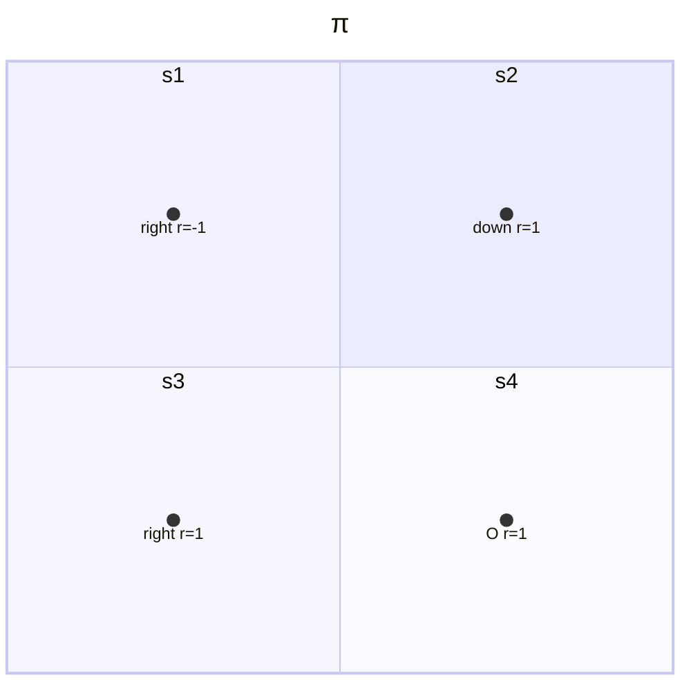

# 3 贝尔曼最优公式

- Bellman Opetimality Equation Keypoints
    - Core Concepts: optimal state value and optimal policy
    - A fundamental tool: the Bellman optimalizy euqation(BOE)

## 3.1 Motivating examples

- In case $\pi$
    - Bellman quation
    $$\begin{aligned}
        v_\pi(s_1)&=-1+\gamma v_\pi(s_2) \\
        v_\pi(s_2)&=+1+\gamma v_\pi(s_4) \\
        v_\pi(s_3)&=+1+\gamma v_\pi(s_4) \\
        v_\pi(s_4)&=+1+\gamma v_\pi(s_4)
    \end{aligned}$$
    - State value: let $\gamma=0.9$，则
    $$v_\pi(s_4)=v_\pi(s_3)=v_\pi(s_2)=10, \quad v_\pi(s_1)=8$$
    - Action value: consider $s_1$
    $$\begin{aligned}
        q_\pi(s_1,a_1)&=-1+\gamma v_\pi(s_1)=6.2 \\
        q_\pi(s_1,a_2)&=-1+\gamma v_\pi(s_2)=8 \\
        q_\pi(s_1,a_3)&=0+\gamma v_\pi(s_3)=9 \\
        q_\pi(s_1,a_4)&=-1+\gamma v_\pi(s_1)=6.2 \\
        q_\pi(s_1,a_5)&=0+\gamma v_\pi(s_1)=7.2
    \end{aligned}$$
    - 当前策略不够好，如何改进？利用Action value！
    - 当前策略$\pi(a|s_1)$可以写成如下形式
    $$\pi(a|s_1)=\begin{cases}
        1\qquad a=a_2 \\ 0 \qquad a\neq a_2
    \end{cases}$$
    - 观察计算的Action values可以发现在$s_1$处$a_3$的action value最大，那么可以尝试采用$a_3$作为当前策略，即
    $$\pi_{new}(a|s_1)=\begin{cases}
        1 \qquad a=a^\ast \\ 0 \qquad a\neq a^\ast
    \end{cases}$$
    - 其中$a^\ast=\argmax_a q_\pi(s_1,a)=a_3$
    - 为什么重复选择（迭代）可以得到最优策略？直观上不好理解，但贝尔曼最优公式可以从数学角度回答。

## 3.2 Optimal policy

- 定义state value的好坏
    - 如果一个策略满足
    $$v_{\pi_1}(s)\geq v_{\pi_2} \qquad \text{for all}\quad s\in\mathcal{S}$$
    - 那么可以说$\pi_1$优于$\pi_2$
    - 则定义最优策略为：策略$\pi^\ast$在当$v_{\pi^\ast}(s)\geq v_\pi(s)$对于任何状态$s$和任何其他策略$\pi$都成立，则策略$\pi^\ast$是最优策略
    - 由最优策略引出的问题
        - 最优策略是否存在？
        - 最优策略是否唯一？
        - 最优策略是随机性还是确定性的？
        - 如何得到最优策略？
    - 通过研究贝尔曼最优公式来回答上述问题

- 贝尔曼最优公式(Bellman Optimal Equation, BOE)
    - 元素形式
    $$\begin{aligned}
      v(s)&=\max_\pi \sum_a\pi(a|s)\left(\sum_r p(r|s,a)r+\gamma\sum_{s'} p(s'|s,a)v(s')\right),\quad\forall s\in \mathcal{S} \\ &= \max_\pi \sum_a\pi(a|s)q(s,a)\quad s\in\mathcal{S}
    \end{aligned}$$
    - 分析
        - $p(r|s,a),p(s'|s,a)$已知
        - $v(s),v(s')$未知但可计算
        - $\pi(s)$是否可知？
    - 矩阵-向量形式
    $$v=\max_\pi(r_\pi+\gamma P_\pi v)$$
    - 其中
    $$[r_\pi]_s\triangleq\sum_a\pi(a|s)\sum_r p(r|s,a)r$$
    $$[P_\pi]_{s,s'}=p(s'|s)\triangleq\sum_a\pi(a|s)\sum_{s'} p(s'|s,a)$$
    - 此处$\max_\pi$操作是对矩阵的每一个元素做的
    - 形式简洁，内涵丰富（最优化问题）

- BOE右侧表达式的最大值
    - 求解
    $$v(s)=\max_\pi \sum_a\pi(a|s)\left(\sum_r p(r|s,a)r+\gamma\sum_{s'} p(s'|s,a)v(s')\right),\quad\forall s\in \mathcal{S} $$
    $$v=\max_\pi(r_\pi+\gamma P_\pi v)$$
    - $v'(s)$未知，先给定初始$v'(s)$再求解$\pi$
     $$\begin{aligned}
      v(s)&=\max_\pi \sum_a\pi(a|s)\left(\sum_r p(r|s,a)r+\gamma\sum_{s'} p(s'|s,a)v(s')\right),\quad\forall s\in \mathcal{S} \\ &= \max_\pi \sum_a\pi(a|s)q(s,a)
    \end{aligned}$$
    - 考虑$\sum_a\pi(a|s)=1$，即若某action的reward最大，则令采取该action的概率最大，此时可获取最优return，因此可以得到
    $$\max_\pi \sum_a\pi(a|s)q(s,a) = \max_{a\in \mathcal{A}(s)}q(s,a)$$
    - 其中最优值在
    $$\pi(a|s)=\begin{cases}
        1\qquad a=a^\ast \\ 0\qquad a\neq a^\ast
    \end{cases}$$
    - 其中$a^\ast=\argmax_a q(s,a)$
    - 上述过程展示了右侧表达式最优项的处理方法
