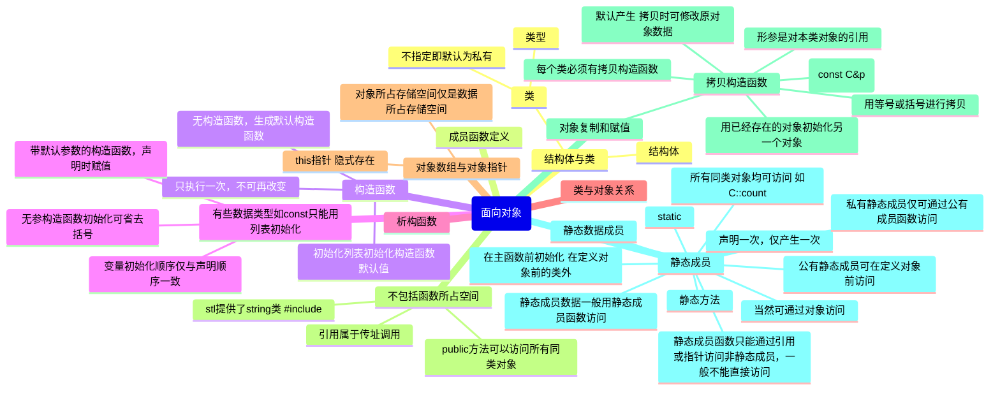
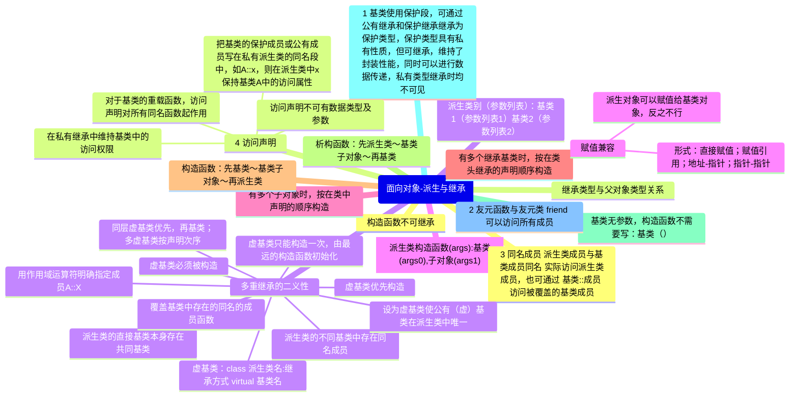
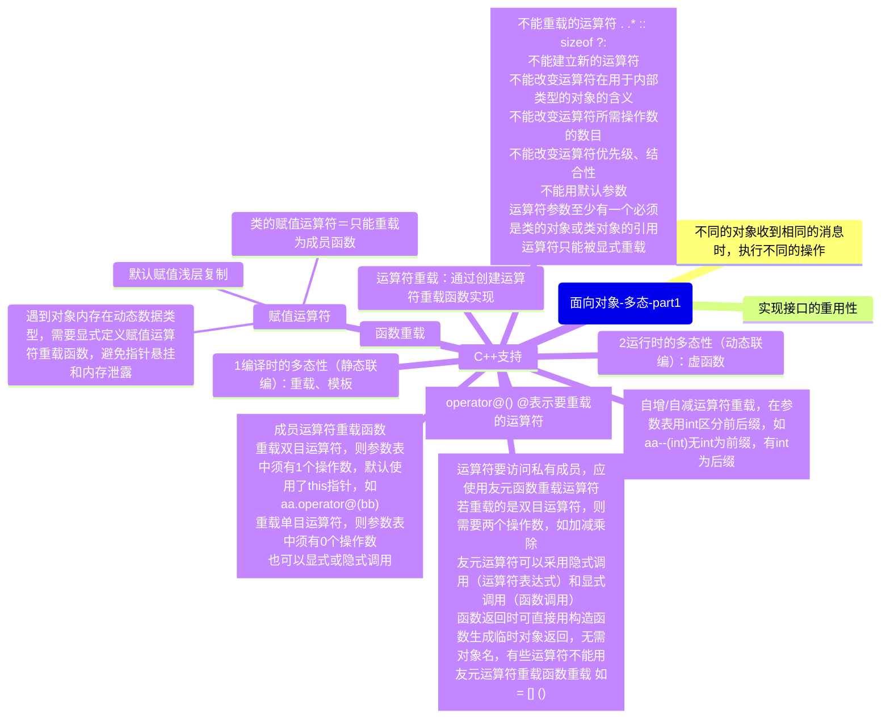
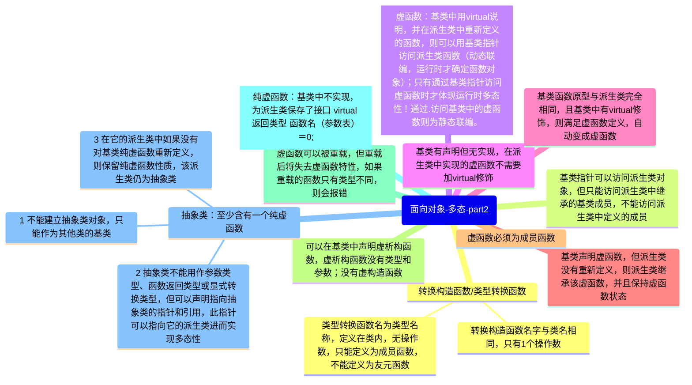
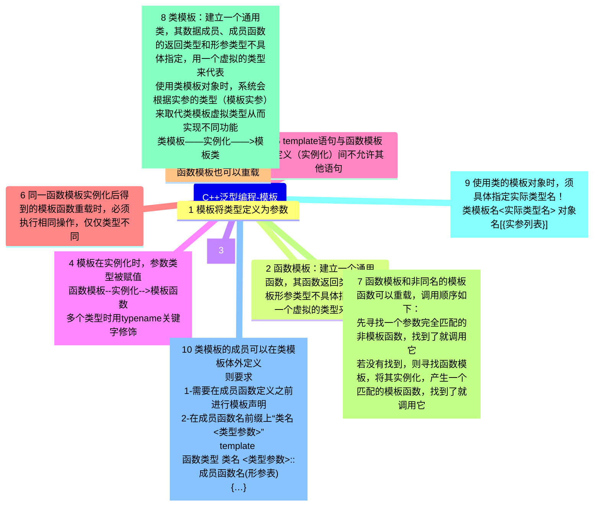
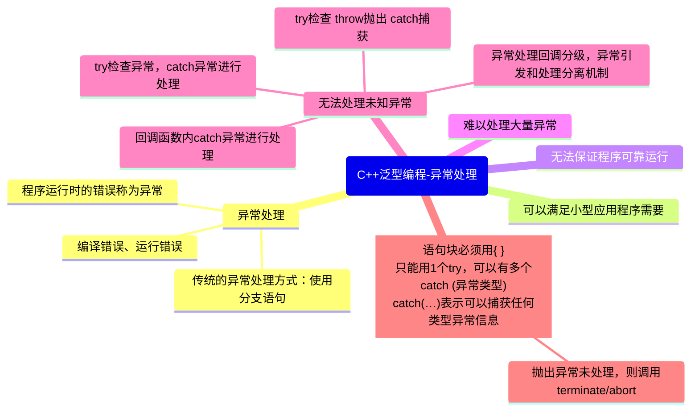

# C++面向对象

``` mermaid
mindmap
root(面向对象)
    结构体与类
        类
            不指定即默认为私有
            类型
        结构体
    成员函数定义
    构造函数
        只执行一次，不可再改变
        无构造函数，生成默认构造函数
        初始化列表初始化构造函数默认值
    有些数据类型如const只能用列表初始化
        变量初始化顺序仅与声明顺序一致
        无参构造函数初始化可省去括号
        带默认参数的构造函数，声明时赋值
    析构函数
    类与对象关系
    对象数组与对象指针
        this指针 隐式存在
        对象所占存储空间仅是数据所占存储空间
    不包括函数所占空间
        stl提供了string类 #include <string>
        引用属于传址调用
        public方法可以访问所有同类对象
    对象复制和赋值
        拷贝构造函数
            用已经存在的对象初始化另一个对象
            形参是对本类对象的引用
            每个类必须有拷贝构造函数
            默认产生 拷贝时可修改原对象数据
            可写作 C(const C&p)
            用等号或括号进行拷贝
    静态成员
        静态数据成员
        静态方法
        static
        所有同类对象均可访问 如C::count
        声明一次，仅产生一次
        在主函数前初始化 在定义对象前的类外
        公有静态成员可在定义对象前访问
        当然可通过对象访问
        私有静态成员仅可通过公有成员函数访问
        静态成员数据一般用静态成员函数访问
        静态成员函数只能通过引用或指针访问非静态成员，一般不能直接访问
    
```

```mermaid
mindmap
root(面向对象-派生与继承)
    构造函数不可继承
    继承类型与父对象类型关系
    派生类别（参数列表）：基类1（参数列表1）基类2（参数列表2）
    id0["`派生类构造函数(args):基类(args0),子对象(args1)`"]
    有多个子对象时，按在类中声明的顺序构造
    有多个继承基类时，按在类头继承的声明顺序构造
    构造函数：先基类～基类子对象～再派生类
    析构函数：先派生类～基类子对象～再基类
    基类无参数，构造函数不需要写：基类（）
    1 基类使用保护段，可通过公有继承和保护继承继承为保护类型，保护类型具有私有性质，但可继承，维持了封装性能，同时可以进行数据传递，私有类型继承时均不可见
    2 友元函数与友元类 friend 可以访问所有成员
    3 同名成员 派生类成员与基类成员同名 实际访问派生类成员，也可通过 基类::成员 访问被覆盖的基类成员
    4 访问声明 
        在私有继承中维持基类中的访问权限 
        把基类的保护成员或公有成员写在私有派生类的同名段中，如A::x，则在派生类中x保持基类A中的访问属性
        访问声明不可有数据类型及参数
        对于基类的重载函数，访问声明对所有同名函数起作用
    多重继承的二义性
        派生类的不同基类中存在同名成员
        派生类的直接基类本身存在共同基类
        用作用域运算符明确指定成员A::X
        覆盖基类中存在的同名的成员函数
        虚基类：class 派生类名:继承方式 virtual 基类名
        设为虚基类使公有（虚）基类在派生类中唯一
        虚基类必须被构造
        虚基类只能构造一次，由最远的构造函数初始化
        虚基类优先构造
        同层虚基类优先，再基类；多虚基类按声明次序
    赋值兼容
        派生对象可以赋值给基类对象，反之不行
        形式：直接赋值；赋值引用；地址-指针；指针-指针
```

```mermaid
mindmap
root(面向对象-多态-part1)
	不同的对象收到相同的消息时，执行不同的操作
	实现接口的重用性
	C++支持
        1编译时的多态性（静态联编）：重载、模板
        2运行时的多态性（动态联编）：虚函数
    函数重载
    运算符重载：通过创建运算符重载函数实现
    id0["`operator@() @表示要重载的运算符`"]
    id1["`不能重载的运算符 . .* :: sizeof ?:
        不能建立新的运算符
        不能改变运算符在用于内部类型的对象的含义
        不能改变运算符所需操作数的数目
        不能改变运算符优先级、结合性
        不能用默认参数
        运算符参数至少有一个必须是类的对象或类对象的引用
        运算符只能被显式重载`"]
    id2["运算符要访问私有成员，应使用友元函数重载运算符
    若重载的是双目运算符，则需要两个操作数，如加减乘除
    友元运算符可以采用隐式调用（运算符表达式）和显式调用（函数调用）
    函数返回时可直接用构造函数生成临时对象返回，无需对象名，有些运算符不能用友元运算符重载函数重载 如= [] ()"]
    id3["成员运算符重载函数
    重载双目运算符，则参数表中须有1个操作数，默认使用了this指针，如aa.operator@(bb)
    重载单目运算符，则参数表中须有0个操作数
    也可以显式或隐式调用"]
    id4["自增/自减运算符重载，在参数表用int区分前后缀，如aa--(int)无int为前缀，有int为后缀"]
    赋值运算符
        默认赋值浅层复制
        遇到对象内存在动态数据类型，需要显式定义赋值运算符重载函数，避免指针悬挂和内存泄露
        类的赋值运算符＝只能重载为成员函数
```

```mermaid
mindmap
root(面向对象-多态-part2)
    转换构造函数/类型转换函数
        转换构造函数名字与类名相同，只有1个操作数
        类型转换函数名为类型名称，定义在类内，无操作数，只能定义为成员函数，不能定义为友元函数
    基类指针可以访问派生类对象，但只能访问派生类中继承的基类成员，不能访问派生类中定义的成员
    id0["`虚函数：基类中用virtual说明，并在派生类中重新定义的函数，则可以用基类指针访问派生类函数（动态联编，运行时才确定函数对象）；只有通过基类指针访问虚函数时才体现运行时多态性！通过.访问基类中的虚函数则为静态联编。`"]
    基类有声明但无实现，在派生类中实现的虚函数不需要加virtual修饰
    基类函数原型与派生类完全相同，且基类中有virtual修饰，则满足虚函数定义，自动变成虚函数
    基类声明虚函数，但派生类没有重新定义，则派生类继承该虚函数，并且保持虚函数状态
    虚函数必须为成员函数
    可以在基类中声明虚析构函数，虚析构函数没有类型和参数；没有虚构造函数
    虚函数可以被重载，但重载后将失去虚函数特性，如果重载的函数只有类型不同，则会报错
    id1["`纯虚函数：基类中不实现，为派生类保存了接口 virtual 返回类型 函数名（参数表）＝0;`"]
    抽象类：至少含有一个纯虚函数
        1 不能建立抽象类对象，只能作为其他类的基类
        2 抽象类不能用作参数类型、函数返回类型或显式转换类型，但可以声明指向抽象类的指针和引用，此指针可以指向它的派生类进而实现多态性
        3 在它的派生类中如果没有对基类纯虚函数重新定义，则保留纯虚函数性质，该派生类仍为抽象类
```

# C++泛型编程

```mermaid
mindmap
root(C++泛型编程-模板)
    1 模板将类型定义为参数
    2 函数模板：建立一个通用函数，其函数返回类型和模板形参类型不具体指定，用一个虚拟的类型来代表
    id0["`3 \<template TypeName T\> T 函数名(模板形参列表)  {函数体} `"]
    id1["`4 模板在实例化时，参数类型被赋值
    函数模板--实例化-->模板函数
    多个类型时用typename关键字修饰`"]
    5 template语句与函数模板定义（实例化）间不允许其他语句
    6 同一函数模板实例化后得到的模板函数重载时，必须执行相同操作，仅仅类型不同
    函数模板也可以重载
    id2["`7 函数模板和非同名的模板函数可以重载，调用顺序如下：
    先寻找一个参数完全匹配的非模板函数，找到了就调用它
    若没有找到，则寻找函数模板，将其实例化，产生一个匹配的模板函数，找到了就调用它`"]
    id3["`8 类模板：建立一个通用类，其数据成员、成员函数的返回类型和形参类型不具体指定，用一个虚拟的类型来代表
    使用类模板对象时，系统会根据实参的类型（模板实参）来取代类模板虚拟类型从而实现不同功能
    类模板——实例化——>模板类`"]
    id4["`9 使用类的模板对象时，须具体指定实际类型名！
    类模板名<实际类型名> 对象名[{实参列表}]`"]
    id5["`10 类模板的成员可以在类模板体外定义
    则要求
    1-需要在成员函数定义之前进行模板声明
    2-在成员函数名前缀上“类名 <类型参数>”
    template <typename 类型参数>
    函数类型 类名 <类型参数>::成员函数名(形参表)
    {…}`"]
```

```mermaid
mindmap
root(C++泛型编程-异常处理)
    异常处理
        编译错误、运行错误
        程序运行时的错误称为异常
        传统的异常处理方式：使用分支语句
    可以满足小型应用程序需要
    无法保证程序可靠运行
    难以处理大量异常
    无法处理未知异常
        异常处理回调分级，异常引发和处理分离机制
        try检查 throw抛出 catch捕获
        回调函数内catch异常进行处理
        try检查异常，catch异常进行处理
    id0["`语句块必须用{ }
    只能用1个try，可以有多个catch (异常类型)
    catch(…)表示可以捕获任何类型异常信息`"]
        抛出异常未处理，则调用terminate/abort
```

> 存在编码冲突而难以展示的内容，采用图片展示

# C++非面向对象方面的扩充

