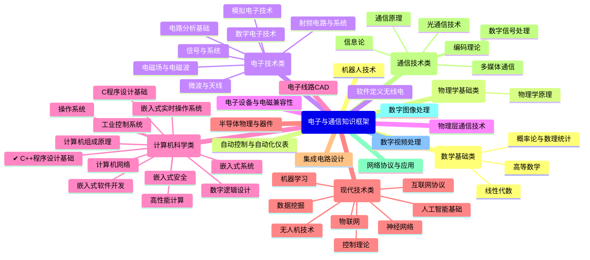

# 目标

本系列将以思维导图形式，着重绘制电子与通信相关的知识框架。其中每篇文章构建一个课程的知识框架，这需要结合笔记、个人见解、书籍内容等，是一个较为庞大的任务，之后将对此逐渐丰富。思维导图在xmind创建后，可导出markdown文件，经AI辅助修改后转换为mermiad-mindmap格式。CloudDoc展示部分可采用mermaid，应同时给出xmind文件以便下载修改。须注意：采用mindmap绘制，各节点位置顺序不固定，因此在之后必须添加标题序号，以保证添加内容前后阅读的连贯性

本系列不宜以追求大而全为目标，这不可能实现，也会导致拖延甚久。应采取先创建，后细化的方式进行编写。

以`【知识框架】C++程序设计基础`为例，该文档设计优缺点如下——

优点：
- 知识点较为全面、系统
- 分类明确，不重复

缺点：
- 知识点展示过于扁平化
- 过多内容导致展示效果不佳
- 格式难以统一，采用图片，导致难以搜索
- 没有全部采用标题序号

改进：
- 采用递进式，先展示主分支及子节点；然后创建多个子树状图，逐级展示知识点
- 含有编码的内容不适宜采用mindmap展示，因为会发生编码冲突

# 应用

对于掌握知识本身，构建知识框架十分重要。人类孱弱的记忆力不足以直接掌握所有细节，但如果可以提纲挈领地理解核心内容，便可通过推理发散填充更多细节。

对于特定的任务目标，了解包含的技术栈和工具，以及需要具备的基础知识，是十分重要的。绘制思维导图有助于辅助思考和快速查找并构建任务完成模型，进行任务安排。无论是理论研究还是工程应用，知己知彼百战不殆。正如软件工程所追求的目标，要做到明确需求，了解工具，才能更好地开发出易用的产品。

在样例中，将尝试摸索出一个自顶向下创建知识框架的做法，这种做法的典型应用是稚晖君在构建产品初期所做的准备工作。

# 主体框架

下面是由AI给出的主体框架样板。未来实际实现的框架因个人学习内容将而有所侧重。标注`✔`的是知识框架中已绘制的内容。

