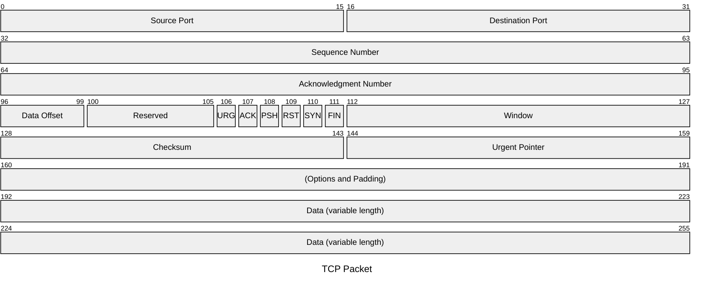
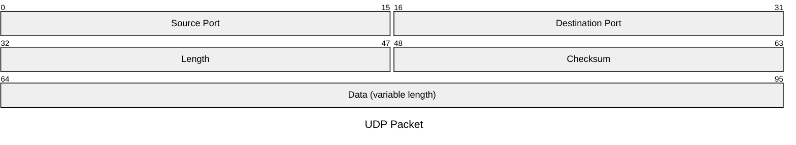
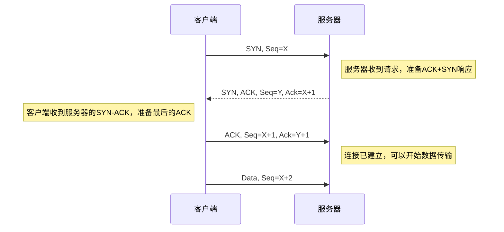

# 传输层

## 3.1 概述和传输层服务
- 网络层：主机之间的逻辑通信
- 传输层：进程之间的逻辑通信
- TCP/UDP均不提供
    - 时延保证
    - 带宽保证

## 3.2 多路复用和解复用
- TCP的复用与解复用
    - Socket
    - Message
    - Segment
    - 逐级封装，源端复用，目标端解复用
    - 目标一致，但源不同，则传输到不同的应用进程



- UDP的复用与解复用
    - 本地IP
    - 本地Port
    - 目标IP
    - 目标Port
    - 目标一致，无论谁发送都传输到同一个进程



## 3.3 无连接传输UDP
- User Datagram Protocol
    - 无连接
    - 不握手
    - 报文乱序（不保序）
- 应用于
    - 流媒体
    - DNS
    - SNMP
- 补充EDC校验等
    - EDC与数据一起出错，但仍满足编码关系：残存错误
    - 校验和校验
    - 不提供差错恢复

## 3.4 可靠数据传输的原理
- 可靠数据传输的底层为UDP
- Reliable Data Transfer（RDT）
- FSM有限状态机实现发送接收过程
    - 发送分组`packet`，接收分组`packet`，接收端校验后回复ACK或NAK
    - 接收端等待一个分组`packet`，但预期可能
    - 每次发送一个分组后等待，为`Stop-and-Wait`模式
    - 在分组前加上分组序号，以便区分分组到达时间
    - 等待`packet0`，来了`packet1`，则无效，需重新发送ACK
    - 目的是回到同步状态
    - 仅有一次ACK/NAK，并没有对ACK/NAK的ACK/NAK，因为不具备完备性
    - 所以分析下次到达的分组情况，判定是否被确认，假设已发送`packet0`的ACK
        - 下次接收到`packet0`？则ACK错误
        - 下次接收到`packet1`？则ACK正确
    - 对ACK/NAK编号，则可知道哪个分组未被正确传输
    - 传输后还需进行EDC校验
    - 发送方超时重传机制，防止相互等待ACK/packet卡死
        - 数据链路层，概率分布集中则确定一个时间
        - 经过传输层，则设置为自适应时间
        - EDC校验不通过，则也可通过ACK超时重发
- 流水线协议
    - 连续发送多个未经确认的分组
    - 发送方需要缓冲区，以便重发
    - 接收方需要缓冲区，以便防止处理不及时
- 滑动窗口协议
    - SW = 1 RW = 1 SW
    - SW > 1 RW = 1 GBN
    - SW > 1 RW > 1 SR
    - 缓冲区内具有发送窗口，发送窗口存储了已发送内容
    - 发送窗口前沿不能超过发送缓冲区
    - 发送窗口后沿抵到已发送未确认分组
    - SW = 1 未确认，不新发(Stop and Wait)
    - RW = 1 只能顺序接收，分组累计确认，只确认序号最高分组(Go Back N)
    - RW > 1 可以乱序接收，分组独立确认，不要求之前分组确认(Selective Repeat)
    - 确认完一个分组，发送窗口后沿向前滑动
    - 异常情况下，发送方重发/超时重发机制，对于不同SW/RW不相同
        - GBN，一次超时，该分组及以前的发送窗口内分组全部重发
        - SR，对每个分组设置一个超时定时器，只重发超时的分组
    - 效率对比
        - GBN，简单，资源少，但出错后回退N步代价大。适用于链路容量有限情况
        - SR，复杂，所需资源多（接收方多个缓存单元）。适用于链路容量大、延迟大情况
    - GBN协议在N个分组序号比特时，序号空间大小为$K=2^N$，最大发送窗口长度为$2^N-1$，是为了区分新旧分组；如果ACK全丢失导致发送方超时，则发送方重传，但接收方无法判断是旧的轮次数据还是新的轮次数据
    ```mermaid
        sequenceDiagram
            title N=3 GBN窗口过长
            participant Sender
            participant Receiver
            participant Channel as "网络（ACK丢失）"

            Note over Sender,Receiver: 场景：GBN 窗口=8，ACK全部丢失 → 歧义！

            Sender->>Receiver: 发送 0,1,2,3,4,5,6,7
            Receiver-->>Channel: ACK 0,1,2,3,4,5,6,7 (全部丢失)
            
            Note over Channel: 所有ACK丢失，发送方超时

            Sender->>Receiver: 重传 0,1,2,3,4,5,6,7
            Receiver->>Receiver: ❌ 问题：收到“0”时无法判断<br/>是新一轮数据？还是旧重传？
            
            Note over Receiver: 歧义！可能误将重传当作新数据接收
    ```
    - SR协议在N个分组序号比特，序号空间大小为$K=2^N$，最大发送/接收窗口长度为$2^{N-1}$，是为了避免序号回绕；如果ACK全丢失导致发送方超时，但接收方已交付，那么发送方重传，不为接收方的预期分组
    ``` mermaid
        sequenceDiagram
            title N=3 SR窗口过长
            participant Sender
            participant Receiver
            participant Network

            Note over Sender,Receiver: SR 协议，窗口=5 > 4 → 歧义！

            Sender->>Receiver: 发送 0,1,2,3,4 (第一轮)
            Receiver-->>Network: ACK 0~4 (全部丢失)
            
            Sender->>Sender: 超时，重传 0,1,2,3,4
            Sender->>Receiver: 重传分组 0

            Note over Receiver: 接收方已交付0~4，正在等待5~7,0...
            Receiver->>Receiver: ❓ 收到“0”：<br/>是重传？还是新一轮开始？
            
            Note over Receiver: 歧义！SR必须限制窗口≤2^(N-1)
    ```

## 3.5 面向连接的传输：TCP
- 先协定分组序，如ACK=555
- TCP的分组结构中，MSS是个重要概念

    ``` mermaid
    ---
    title: "MTU Structure"
    ---
    packet
    0-19: "IP Header"
    20-39: "TCP Header"
    40-95: "Payload(1460 bytes Max)"
    ```

- 本质上，MSS 等于 MTU 减去 TCP 标头和 IP 标头的大小
- 如果数据包超过设备的 MTU，则会分解为更小的部分，或“分段”
- 相反，如果一个数据包超过 MSS，它就会被丢弃并且不会被传递
- TCP往返延时（RTT）和超时
    - $EstimatedRTT = (1 - \alpha)EstimatedRTT + \alpha SampleRTT$
    - 指数加权移动平均
    - 过去样本的影响呈指数衰减
    - 推荐值：$\alpha = 0.125$
    - $DevRTT = (1-\beta)DevRTT + \beta |SampleRTT - EstimateRTT|$
    - 推荐值：$\beta = 0.25$
    - $DevRTT$测算采样与平均值的差距，相当于方差
    - 超时时间间隔设置为：$TimeoutInterval = EstimatedRTT + 4\times DevRTT$
- TCP是Pipeline协议，是GBN与SR的混合体
- 快速重传：超时定时器未触发，连续收到3个重复ACK就执行重传
- ACK包含了期待分组的序号
- 产生TCP ACK的建议`RFC 1122`、`RFC 2581`
    - 辅助定时器(500ms)：已接收一段但不发确认，辅助定时器未超时且接收到第二段则发送确认，可提高效率
    - 比期望序号大的报文段乱序到达，检测出数据流中的间隔，则立即发送重复的ACK，指明下一个期待的序号
        - 连续三个重复ACK，虽然未超时，但仍然重传，速度更快（快速重传）
    - 能部分或完全填充接收数据间隔的报文段到达，若该报文段起始于间隔(gap)低端，则立即发送ACK

    ``` mermaid
    sequenceDiagram
        participant Sender as 发送方 (TCP)
        participant Receiver as 接收方 (TCP)
        participant Network as 网络（丢包）

        Note over Sender,Receiver: TCP 快速重传（Fast Retransmit）示例

        Sender->>Receiver: 发送 Seq=100, Len=100
        Receiver-->>Sender: ACK=200 (确认收到100)

        Sender->>Network: 发送 Seq=200, Len=100 (丢失!)
        Note right of Network: 分组丢失

        Sender->>Receiver: 发送 Seq=300, Len=100
        Receiver-->>Sender: ACK=200 (重复ACK：期望Seq=200)
        
        Sender->>Receiver: 发送 Seq=400, Len=100
        Receiver-->>Sender: ACK=200 (重复ACK：期望Seq=200)

        Receiver-->>Sender: ACK=200 (重复ACK：第3个DupACK)

        Note over Sender: 收到第3个重复ACK<br/>触发快速重传!
        Sender->>Receiver: 重传 Seq=200, Len=100

        Receiver->>Sender: ACK=500 (确认收到200, 300, 400)

        Note over Receiver: 乱序包被缓存<br/>收到200后按序交付
    ```

- TCP流量控制
  - 接收方在其向发送方发送的TCP报文头部的rwnd字段通告其空闲Buffer大小
    - Rcvbuffer大小通过socket选项设置，其典型大小为4096字节
    - 很多操作系统自动调整RcvBuffer   
  - 发送方限制未确认字节的个数<=接收方发来的rwnd值
  - 保证接收方不会出现缓存溢出
- Piggybacking
  - 相互发送时在发送报文内加入对接收报文的ACK
- TCP连接管理
  - 第三次握手即可同时传输数据
  - 客户端向服务器发起连接请求，TCP需三次握手，相互告诉初始序号和回复确认，因此需要三次，可防止维护半连接，还防止将老数据当新数据接收


  
- TCP连接探讨
  - 若只有两次握手，则可能出现
    - 维护大量旧连接（半连接）导致服务器资源耗尽的情况
    - 把旧数据当成新数据接收

- TCP关闭连接
  - 两个方向，分别拆除（发送请求，接收ACK）
  - 存在两军问题：只要最后一个拆除报文不可靠，整个拆除过程就是不可靠的
  - 连接释放并不完美
  
- 截断攻击：第三方切入发送连接释放请求，连接意外释放，只能被感知而无法防御

## 3.6 拥塞控制原理

- 拥塞的原因/代价
    - 场景1
        - 2个发送端，2个接收端
        - 1个路由器拥有无限大缓冲区
        - 输出链路带宽R
        - 没有重传
        - 最大速率R/2
    - 场景2
        - 一个路由器，有限缓冲
        - 分组丢失时，发送端重传
        - 应用层输入=应用层输出：$\lambda_{in} = \lambda_{out}$
        - 传输层输入包括重传：$\lambda_{in}^{''}\ge\lambda_{in}$
    - 场景3
        - 4个发送端
        - 多重路径
        - 超时重传
        - 分组丢失时，任何“关于这个分组的上游传输能力”都被浪费掉了
- 拥塞控制方法
    - 端系统自行判断是否发生拥塞
        - 分组丢失，很可能发生拥塞
- 例子ATM ABR(Available Bit Rate)拥塞控制
    - RM(Resource Management)信元：53B小分组
    - 信元标志位被交换机设置，判断是否拥塞
    - 信元被接收端原样返回
    - 信元被插入到多个发送分组之间
    - 源主机根据信元标志位调整速率

## 3.7 TCP拥塞
- TCP为端到端拥塞控制
    - 降低网络核心负担
    - 网络不提供拥塞信息
    - 端系统拥塞感知
        - 分组丢失，很可能发生拥塞
        - 收到3个冗余ACK，发生了快速重传
        - 若比特翻转未通过校验，产生超时重传，不应该降低传输速度，但误动作概率小，所以仍可使用拥塞控制策略
    - CongWin（拥塞窗口）是拥塞情况的函数
    - SS(Slow Start)阶段：加倍增加（每个RTT），快速探测可用带宽
    - CA(Congestion Avoidance)阶段：线性增加（每个RTT），线性增长避免再次拥塞
    - 超时时：CongWin降为1MSS，进入SS阶段再倍增到CongWin/2（每个RTT），从而进入CA阶段
        - CA开始阈值设为ConWin/2，仍从0开始增加
        - 吞吐量$T = \dfrac{3}{4}\dfrac{W}{RTT}$
    - SS阶段时间相比CA可忽略
- 流量控制，拥塞控制联合控制
    - 未确认，拥塞窗口1MSS（1460Bytes）
- 公平性
    - 每个主机对均分瓶颈带宽
    - SS阶段到超时，再除以2，逐渐收敛

## 总结
- 传输层提供的服务
    - 应用进程间的逻辑通信
        - Vs网络层提供主机到主机之间的通信服务
    - TCP/UDP
- 多路复用和解复用
    - 端口：传输层SAP
    - 无连接的多路复用和解复用
    - 面向连接的多路复用和解复用
- 无连接传输层协议UDP
    - 多路复用和解复用
    - UDP报文格式
    - 检错机制：校验和
- 可靠数据传输原理
    - 问题描述
    - 停止等待协议(RDT1.0/2.0/2.1/2.2/3.0)SW
    - 流水线协议
        - GBN
        - SR
- 面向连接的传输层协议TCP
    - TCP特性
    - 报文段格式-序号超时机制及时间
    - TCP可靠传输机制
    - 重传，快速重传
    - 流量控制
    - 连接管理
        - 三次握手
        - 对称连接释放
    - 拥塞控制原理
        - 网络辅助的拥塞控制
        - 端到端的拥塞控制
- TCP的拥塞控制
    - AIMD
    - 慢启动(SS)
    - 超时之后的保守策略

