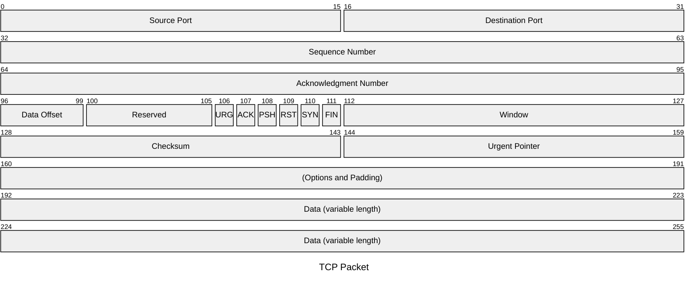
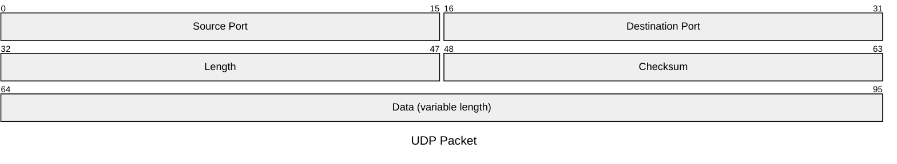

# 3.1 概述和传输层服务
- 网络层：主机之间的逻辑通信
- 传输层：进程之间的逻辑通信
- TCP/UDP均不提供
    - 时延保证
    - 带宽保证

# 3.2 多路复用和解复用
- TCP的复用与解复用
    - Socket
    - Message
    - Segment
    - 逐级封装，源端复用，目标端解复用
    - 目标一致，但源不同，则传输到不同的应用进程



- UDP的复用与解复用
    - 本地IP
    - 本地Port
    - 目标IP
    - 目标Port
    - 目标一致，无论谁发送都传输到同一个进程



# 3.3 无连接传输UDP
- User Datagram Protocol
    - 无连接
    - 不握手
    - 报文乱序（不保序）
- 应用于
    - 流媒体
    - DNS
    - SNMP
- 补充EDC校验等
    - EDC与数据一起出错，但仍满足编码关系：残存错误
    - 校验和校验
    - 不提供差错恢复

# 3.4 可靠数据传输的原理
- 可靠数据传输的底层为UDP
- Reliable Data Transfer（RDT）
- FSM有限状态机实现发送接收过程
    - 发送分组`packet`，接收分组`packet`，接收端校验后回复ACK或NAK
    - 接收端等待一个分组`packet`，但预期可能
    - 每次发送一个分组后等待，为`Stop-and-Wait`模式
    - 在分组前加上分组序号，以便区分分组到达时间
    - 等待`packet0`，来了`packet1`，则无效，需重新发送ACK
    - 目的是回到同步状态
    - 仅有一次ACK/NAK，并没有对ACK/NAK的ACK/NAK，因为不具备完备性
    - 所以分析下次到达的分组情况，判定是否被确认，假设已发送`packet0`的ACK
        - 下次接收到`packet0`？则ACK错误
        - 下次接收到`packet1`？则ACK正确
    - 对ACK/NAK编号，则可知道哪个分组未被正确传输
    - 传输后还需进行EDC校验
    - 发送方超时重传机制，防止相互等待ACK/packet卡死
        - 数据链路层，概率分布集中则确定一个时间
        - 经过传输层，则设置为自适应时间
        - EDC校验不通过，则也可通过ACK超时重发
- 流水线协议
    - 连续发送多个未经确认的分组
    - 发送方需要缓冲区，以便重发
    - 接收方需要缓冲区，以便防止处理不及时
- 滑动窗口协议
    - SW = 1 RW = 1 SW
    - SW > 1 RW = 1 GBN
    - SW > 1 RW > 1 SR
    - 缓冲区内具有发送窗口，发送窗口存储了已发送内容
    - 发送窗口前沿不能超过发送缓冲区
    - 发送窗口后沿抵到已发送未确认分组
    - SW = 1 未确认，不新发(Stop and Wait)
    - RW = 1 只能顺序接收，分组累计确认，只确认序号最高分组(Go Back N)
    - RW > 1 可以乱序接收，分组独立确认，不要求之前分组确认(Selective Repeat)
    - 确认完一个分组，发送窗口后沿向前滑动
    - 异常情况下，发送方重发/超时重发机制，对于不同SW/RW不相同
        - GBN，一次超时，该分组及以前的发送窗口内分组全部重发
        - SR，对每个分组设置一个超时定时器，只重发超时的分组
    - 效率对比
        - GBN，简单，资源少，但出错后回退N步代价大。适用于链路容量有限情况
        - SR，复杂，所需资源多（接收方多个缓存单元）。适用于链路容量大、延迟大情况
    - GBN协议在N个分组序号比特时，序号空间大小为$K=2^N$，最大发送窗口长度为$2^N-1$，是为了区分新旧分组；如果ACK全丢失导致发送方超时，则发送方重传，但接收方无法判断是旧的轮次数据还是新的轮次数据
    ```mermaid
        sequenceDiagram
            title N=3 GBN窗口过长
            participant Sender
            participant Receiver
            participant Channel as "网络（ACK丢失）"

            Note over Sender,Receiver: 场景：GBN 窗口=8，ACK全部丢失 → 歧义！

            Sender->>Receiver: 发送 0,1,2,3,4,5,6,7
            Receiver-->>Channel: ACK 0,1,2,3,4,5,6,7 (全部丢失)
            
            Note over Channel: 所有ACK丢失，发送方超时

            Sender->>Receiver: 重传 0,1,2,3,4,5,6,7
            Receiver->>Receiver: ❌ 问题：收到“0”时无法判断<br/>是新一轮数据？还是旧重传？
            
            Note over Receiver: 歧义！可能误将重传当作新数据接收
    ```
    - SR协议在N个分组序号比特，序号空间大小为$K=2^N$，最大发送/接收窗口长度为$2^{N-1}$，是为了避免序号回绕；如果ACK全丢失导致发送方超时，但接收方已交付，那么发送方重传，不为接收方的预期分组
    ``` mermaid
        sequenceDiagram
            title N=3 SR窗口过长
            participant Sender
            participant Receiver
            participant Network

            Note over Sender,Receiver: SR 协议，窗口=5 > 4 → 歧义！

            Sender->>Receiver: 发送 0,1,2,3,4 (第一轮)
            Receiver-->>Network: ACK 0~4 (全部丢失)
            
            Sender->>Sender: 超时，重传 0,1,2,3,4
            Sender->>Receiver: 重传分组 0

            Note over Receiver: 接收方已交付0~4，正在等待5~7,0...
            Receiver->>Receiver: ❓ 收到“0”：<br/>是重传？还是新一轮开始？
            
            Note over Receiver: 歧义！SR必须限制窗口≤2^(N-1)
    ```


